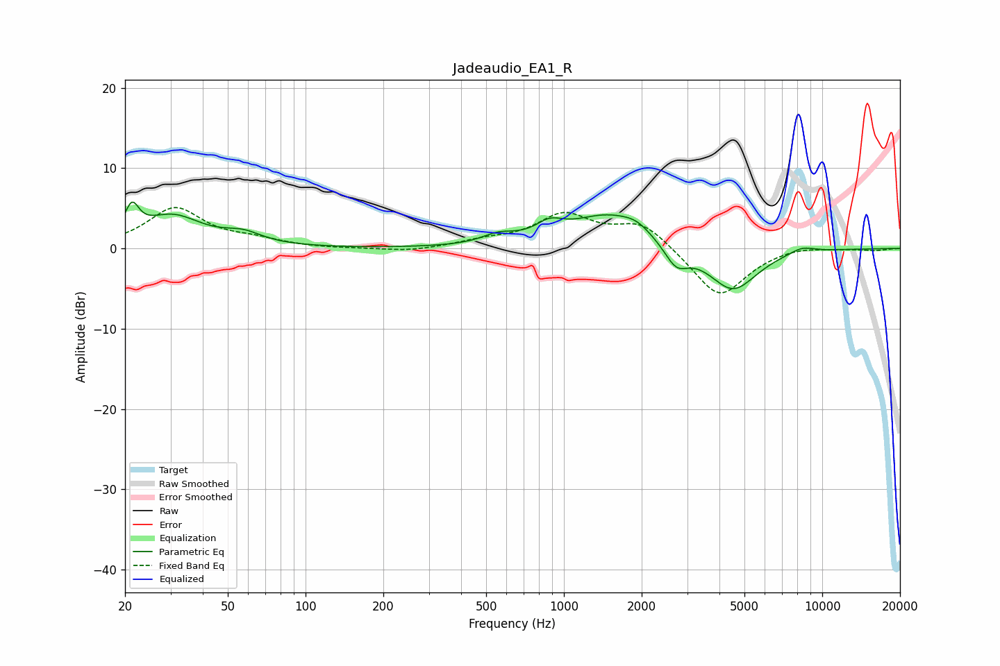

# Jadeaudio_EA1_R
See [usage instructions](https://github.com/jaakkopasanen/AutoEq#usage) for more options and info.

### Parametric EQs
Apply preamp of -5.9 dB when using parametric equalizer.

|   # | Type    |   Fc (Hz) |    Q |   Gain (dB) |
|-----|---------|-----------|------|-------------|
|   1 | Peaking |        21 | 5.24 |         3.5 |
|   2 | Peaking |        30 | 1.22 |         3.9 |
|   3 | Peaking |        57 | 1.91 |         1.3 |
|   4 | Peaking |       559 | 2.17 |         1.1 |
|   5 | Peaking |       878 | 2.6  |         1.7 |
|   6 | Peaking |      1483 | 0.97 |         4   |
|   7 | Peaking |      1916 | 2.55 |         1   |
|   8 | Peaking |      2721 | 3.13 |        -2.6 |
|   9 | Peaking |      4504 | 1.48 |        -5.4 |
|  10 | Peaking |      8347 | 2.61 |         0.8 |

### Fixed Band EQs
When using fixed band (also called graphic) equalizer, apply preamp of **-5.2 dB** (if available) and set gains manually with these parameters.

|   # | Type    |   Fc (Hz) |    Q |   Gain (dB) |
|-----|---------|-----------|------|-------------|
|   1 | Peaking |        31 | 1.41 |         4.9 |
|   2 | Peaking |        62 | 1.41 |         0.8 |
|   3 | Peaking |       125 | 1.41 |        -0.1 |
|   4 | Peaking |       250 | 1.41 |        -0.5 |
|   5 | Peaking |       500 | 1.41 |         0.8 |
|   6 | Peaking |      1000 | 1.41 |         4   |
|   7 | Peaking |      2000 | 1.41 |         3.2 |
|   8 | Peaking |      4000 | 1.41 |        -6.3 |
|   9 | Peaking |      8000 | 1.41 |         0.5 |
|  10 | Peaking |     16000 | 1.41 |        -0.2 |

### Graphs

