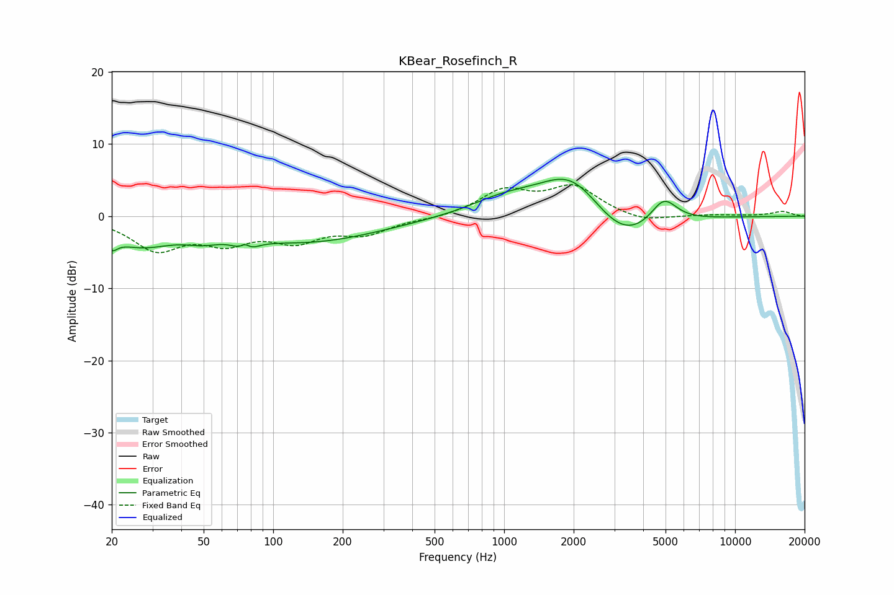

# KBear_Rosefinch_R
See [usage instructions](https://github.com/jaakkopasanen/AutoEq#usage) for more options and info.

### Parametric EQs
Apply preamp of -5.2 dB when using parametric equalizer.

|   # | Type    |   Fc (Hz) |    Q |   Gain (dB) |
|-----|---------|-----------|------|-------------|
|   1 | Peaking |        20 | 5.79 |        -1.6 |
|   2 | Peaking |        26 | 0.95 |        -3.5 |
|   3 | Peaking |        49 | 1.85 |        -1.1 |
|   4 | Peaking |        76 | 5.62 |         2.9 |
|   5 | Peaking |        76 | 4.08 |        -3.5 |
|   6 | Peaking |       142 | 0.45 |        -3.4 |
|   7 | Peaking |       989 | 0.96 |         1.9 |
|   8 | Peaking |      1972 | 0.95 |         6.7 |
|   9 | Peaking |      3240 | 0.94 |        -5.2 |
|  10 | Peaking |      4911 | 2.42 |         3.7 |

### Fixed Band EQs
When using fixed band (also called graphic) equalizer, apply preamp of **-4.5 dB** (if available) and set gains manually with these parameters.

|   # | Type    |   Fc (Hz) |    Q |   Gain (dB) |
|-----|---------|-----------|------|-------------|
|   1 | Peaking |        31 | 1.41 |        -4.4 |
|   2 | Peaking |        62 | 1.41 |        -3.1 |
|   3 | Peaking |       125 | 1.41 |        -3   |
|   4 | Peaking |       250 | 1.41 |        -2.2 |
|   5 | Peaking |       500 | 1.41 |        -0.3 |
|   6 | Peaking |      1000 | 1.41 |         3.4 |
|   7 | Peaking |      2000 | 1.41 |         3.9 |
|   8 | Peaking |      4000 | 1.41 |        -0.9 |
|   9 | Peaking |      8000 | 1.41 |         0.2 |
|  10 | Peaking |     16000 | 1.41 |         0.7 |

### Graphs

