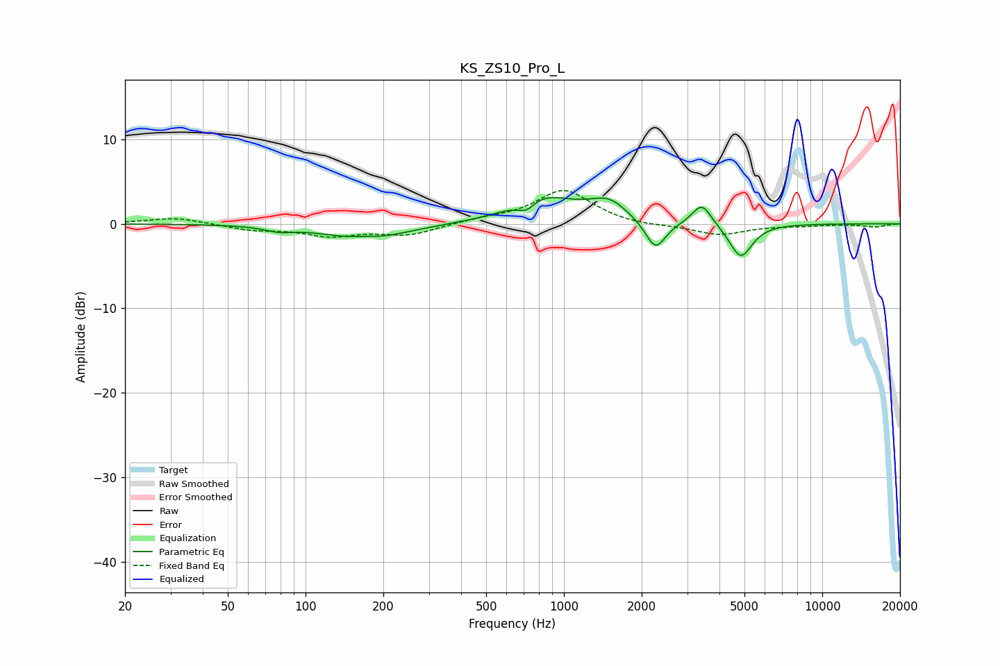

# KS_ZS10_Pro_L
See [usage instructions](https://github.com/jaakkopasanen/AutoEq#usage) for more options and info.

### Parametric EQs
Apply preamp of -3.2 dB when using parametric equalizer.

|   # | Type    |   Fc (Hz) |    Q |   Gain (dB) |
|-----|---------|-----------|------|-------------|
|   1 | Peaking |        79 | 2.68 |        -0.5 |
|   2 | Peaking |       168 | 2.69 |         0.3 |
|   3 | Peaking |       170 | 0.95 |        -1.9 |
|   4 | Peaking |       714 | 4.26 |        -1.2 |
|   5 | Peaking |       827 | 1.17 |         3.1 |
|   6 | Peaking |      1330 | 1.79 |         0.6 |
|   7 | Peaking |      1516 | 2.13 |         1.8 |
|   8 | Peaking |      2264 | 3.62 |        -3.5 |
|   9 | Peaking |      3421 | 3.81 |         2.6 |
|  10 | Peaking |      4838 | 3.17 |        -4.1 |

### Fixed Band EQs
When using fixed band (also called graphic) equalizer, apply preamp of **-4.0 dB** (if available) and set gains manually with these parameters.

|   # | Type    |   Fc (Hz) |    Q |   Gain (dB) |
|-----|---------|-----------|------|-------------|
|   1 | Peaking |        31 | 1.41 |         0.8 |
|   2 | Peaking |        62 | 1.41 |        -0.7 |
|   3 | Peaking |       125 | 1.41 |        -1.3 |
|   4 | Peaking |       250 | 1.41 |        -1.3 |
|   5 | Peaking |       500 | 1.41 |         0.5 |
|   6 | Peaking |      1000 | 1.41 |         4   |
|   7 | Peaking |      2000 | 1.41 |        -0.3 |
|   8 | Peaking |      4000 | 1.41 |        -1.3 |
|   9 | Peaking |      8000 | 1.41 |        -0.2 |
|  10 | Peaking |     16000 | 1.41 |        -0.4 |

### Graphs

