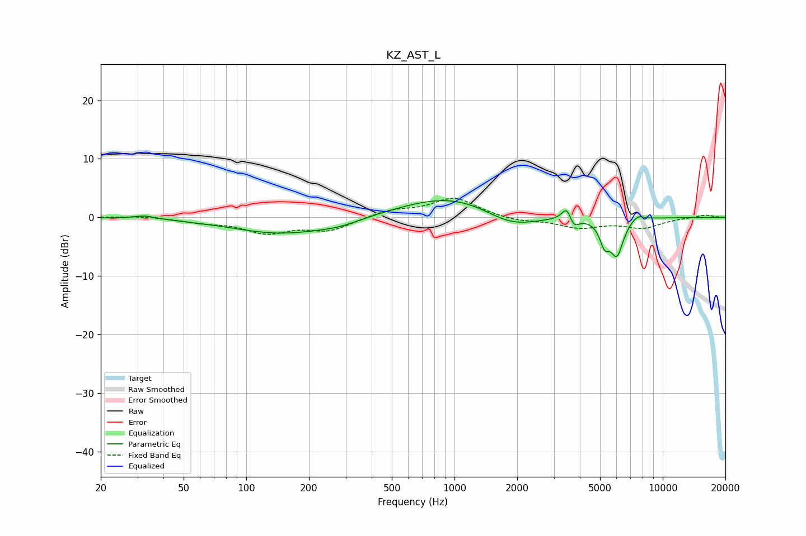

# KZ_AST_L
See [usage instructions](https://github.com/jaakkopasanen/AutoEq#usage) for more options and info.

### Parametric EQs
Apply preamp of -3.0 dB when using parametric equalizer.

|   # | Type    |   Fc (Hz) |    Q |   Gain (dB) |
|-----|---------|-----------|------|-------------|
|   1 | Peaking |        33 | 2.7  |         0.6 |
|   2 | Peaking |       148 | 0.59 |        -2.8 |
|   3 | Peaking |       280 | 1.37 |        -0.7 |
|   4 | Peaking |      1002 | 0.56 |         4   |
|   5 | Peaking |      1862 | 1.03 |        -3.1 |
|   6 | Peaking |      3472 | 6    |         2.6 |
|   7 | Peaking |      3728 | 6    |        -1.9 |
|   8 | Peaking |      5255 | 6    |        -3.5 |
|   9 | Peaking |      6022 | 4.31 |        -6.1 |
|  10 | Peaking |      7540 | 3.91 |         1.1 |

### Fixed Band EQs
When using fixed band (also called graphic) equalizer, apply preamp of **-3.4 dB** (if available) and set gains manually with these parameters.

|   # | Type    |   Fc (Hz) |    Q |   Gain (dB) |
|-----|---------|-----------|------|-------------|
|   1 | Peaking |        31 | 1.41 |         0.3 |
|   2 | Peaking |        62 | 1.41 |        -0.7 |
|   3 | Peaking |       125 | 1.41 |        -2.4 |
|   4 | Peaking |       250 | 1.41 |        -2.1 |
|   5 | Peaking |       500 | 1.41 |         1.2 |
|   6 | Peaking |      1000 | 1.41 |         3.3 |
|   7 | Peaking |      2000 | 1.41 |        -0.6 |
|   8 | Peaking |      4000 | 1.41 |        -1.6 |
|   9 | Peaking |      8000 | 1.41 |        -1.7 |
|  10 | Peaking |     16000 | 1.41 |         0.5 |

### Graphs

