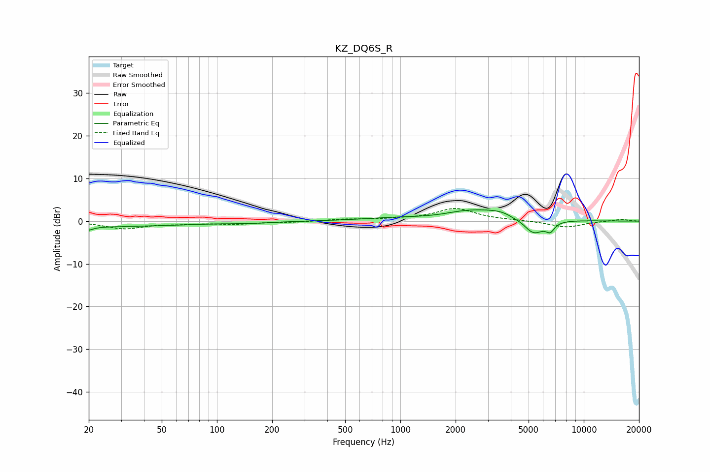

# KZ_DQ6S_R
See [usage instructions](https://github.com/jaakkopasanen/AutoEq#usage) for more options and info.

### Parametric EQs
Apply preamp of -2.7 dB when using parametric equalizer.

|   # | Type    |   Fc (Hz) |    Q |   Gain (dB) |
|-----|---------|-----------|------|-------------|
|   1 | Peaking |        20 | 5.45 |        -1.4 |
|   2 | Peaking |        20 | 0.25 |        -1.3 |
|   3 | Peaking |        20 | 5.97 |         0.6 |
|   4 | Peaking |       153 | 1.28 |        -0.3 |
|   5 | Peaking |       920 | 0.76 |         0.6 |
|   6 | Peaking |      2262 | 1.2  |         1.3 |
|   7 | Peaking |      3740 | 0.95 |         2.5 |
|   8 | Peaking |      4131 | 3.99 |        -0.5 |
|   9 | Peaking |      5303 | 2.37 |        -4.2 |
|  10 | Peaking |      6563 | 5.77 |        -2   |

### Fixed Band EQs
When using fixed band (also called graphic) equalizer, apply preamp of **-3.0 dB** (if available) and set gains manually with these parameters.

|   # | Type    |   Fc (Hz) |    Q |   Gain (dB) |
|-----|---------|-----------|------|-------------|
|   1 | Peaking |        31 | 1.41 |        -1.7 |
|   2 | Peaking |        62 | 1.41 |        -0.4 |
|   3 | Peaking |       125 | 1.41 |        -0.6 |
|   4 | Peaking |       250 | 1.41 |        -0.2 |
|   5 | Peaking |       500 | 1.41 |         0.4 |
|   6 | Peaking |      1000 | 1.41 |         0.3 |
|   7 | Peaking |      2000 | 1.41 |         2.9 |
|   8 | Peaking |      4000 | 1.41 |         0.1 |
|   9 | Peaking |      8000 | 1.41 |        -1.5 |
|  10 | Peaking |     16000 | 1.41 |         0.4 |

### Graphs

