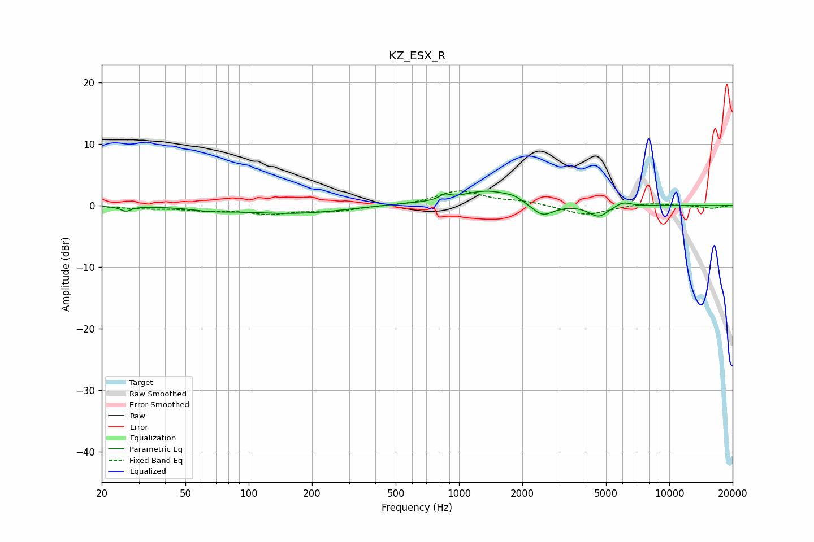

# KZ_ESX_R
See [usage instructions](https://github.com/jaakkopasanen/AutoEq#usage) for more options and info.

### Parametric EQs
Apply preamp of -2.4 dB when using parametric equalizer.

|   # | Type    |   Fc (Hz) |    Q |   Gain (dB) |
|-----|---------|-----------|------|-------------|
|   1 | Peaking |        26 | 5.96 |        -0.8 |
|   2 | Peaking |        66 | 1.81 |        -0.4 |
|   3 | Peaking |       165 | 0.53 |        -1.4 |
|   4 | Peaking |       479 | 0.73 |         0.3 |
|   5 | Peaking |       854 | 6    |         0.8 |
|   6 | Peaking |      1373 | 1.1  |         2.4 |
|   7 | Peaking |      1829 | 3.67 |         0.4 |
|   8 | Peaking |      2493 | 2.67 |        -2.2 |
|   9 | Peaking |      4610 | 3.13 |        -1.9 |
|  10 | Peaking |      6036 | 3.87 |         0.8 |

### Fixed Band EQs
When using fixed band (also called graphic) equalizer, apply preamp of **-2.5 dB** (if available) and set gains manually with these parameters.

|   # | Type    |   Fc (Hz) |    Q |   Gain (dB) |
|-----|---------|-----------|------|-------------|
|   1 | Peaking |        31 | 1.41 |        -0.4 |
|   2 | Peaking |        62 | 1.41 |        -0.7 |
|   3 | Peaking |       125 | 1.41 |        -1.2 |
|   4 | Peaking |       250 | 1.41 |        -0.9 |
|   5 | Peaking |       500 | 1.41 |        -0.1 |
|   6 | Peaking |      1000 | 1.41 |         2.3 |
|   7 | Peaking |      2000 | 1.41 |         0.6 |
|   8 | Peaking |      4000 | 1.41 |        -1.6 |
|   9 | Peaking |      8000 | 1.41 |         0.5 |
|  10 | Peaking |     16000 | 1.41 |        -0.5 |

### Graphs

