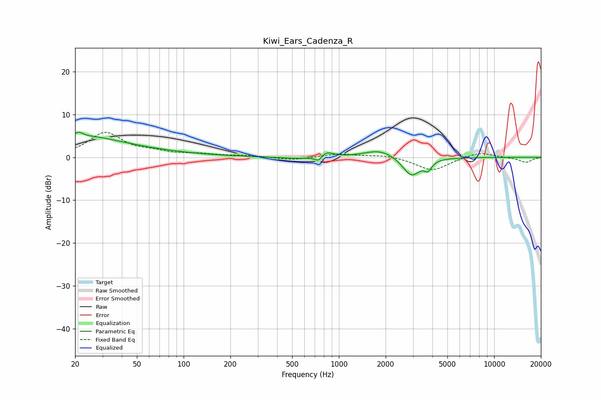

# Kiwi_Ears_Cadenza_R
See [usage instructions](https://github.com/jaakkopasanen/AutoEq#usage) for more options and info.

### Parametric EQs
Apply preamp of -5.9 dB when using parametric equalizer.

|   # | Type    |   Fc (Hz) |    Q |   Gain (dB) |
|-----|---------|-----------|------|-------------|
|   1 | Peaking |        21 | 5.5  |         1.1 |
|   2 | Peaking |        22 | 0.56 |         4.1 |
|   3 | Peaking |        47 | 0.37 |         1   |
|   4 | Peaking |       615 | 1.19 |        -0.5 |
|   5 | Peaking |       643 | 4.48 |         0.1 |
|   6 | Peaking |       739 | 5.94 |        -1.4 |
|   7 | Peaking |       824 | 3.22 |         1.5 |
|   8 | Peaking |      1841 | 1.4  |         1.9 |
|   9 | Peaking |      2930 | 2.51 |        -4.5 |
|  10 | Peaking |      3746 | 5.96 |        -2   |

### Fixed Band EQs
When using fixed band (also called graphic) equalizer, apply preamp of **-5.9 dB** (if available) and set gains manually with these parameters.

|   # | Type    |   Fc (Hz) |    Q |   Gain (dB) |
|-----|---------|-----------|------|-------------|
|   1 | Peaking |        31 | 1.41 |         5.6 |
|   2 | Peaking |        62 | 1.41 |         1   |
|   3 | Peaking |       125 | 1.41 |         0.6 |
|   4 | Peaking |       250 | 1.41 |         0.4 |
|   5 | Peaking |       500 | 1.41 |        -0.7 |
|   6 | Peaking |      1000 | 1.41 |         0.8 |
|   7 | Peaking |      2000 | 1.41 |         0.6 |
|   8 | Peaking |      4000 | 1.41 |        -3.1 |
|   9 | Peaking |      8000 | 1.41 |         1.3 |
|  10 | Peaking |     16000 | 1.41 |        -1.2 |

### Graphs

