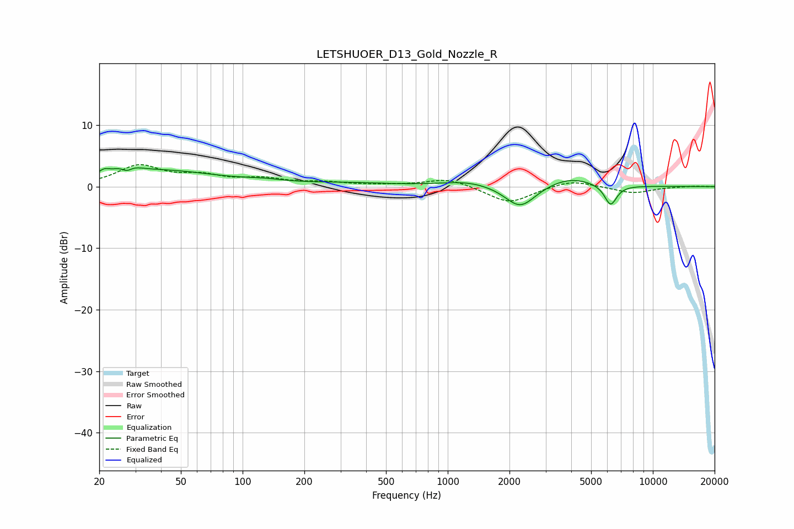

# LETSHUOER_D13_Gold_Nozzle_R
See [usage instructions](https://github.com/jaakkopasanen/AutoEq#usage) for more options and info.

### Parametric EQs
Apply preamp of -3.1 dB when using parametric equalizer.

|   # | Type    |   Fc (Hz) |    Q |   Gain (dB) |
|-----|---------|-----------|------|-------------|
|   1 | Peaking |        21 | 5.86 |         0.8 |
|   2 | Peaking |        27 | 3.01 |         2.6 |
|   3 | Peaking |        27 | 4.66 |        -2.1 |
|   4 | Peaking |        40 | 0.52 |         2.5 |
|   5 | Peaking |       127 | 1.43 |         0.4 |
|   6 | Peaking |       326 | 0.7  |         0.5 |
|   7 | Peaking |      1253 | 1.09 |         0.9 |
|   8 | Peaking |      2257 | 1.91 |        -3.8 |
|   9 | Peaking |      3930 | 1.2  |         1.6 |
|  10 | Peaking |      6224 | 4.58 |        -3.3 |

### Fixed Band EQs
When using fixed band (also called graphic) equalizer, apply preamp of **-3.7 dB** (if available) and set gains manually with these parameters.

|   # | Type    |   Fc (Hz) |    Q |   Gain (dB) |
|-----|---------|-----------|------|-------------|
|   1 | Peaking |        31 | 1.41 |         3.2 |
|   2 | Peaking |        62 | 1.41 |         1.5 |
|   3 | Peaking |       125 | 1.41 |         1.1 |
|   4 | Peaking |       250 | 1.41 |         0.6 |
|   5 | Peaking |       500 | 1.41 |         0.2 |
|   6 | Peaking |      1000 | 1.41 |         1.4 |
|   7 | Peaking |      2000 | 1.41 |        -2.7 |
|   8 | Peaking |      4000 | 1.41 |         1.2 |
|   9 | Peaking |      8000 | 1.41 |        -1.1 |
|  10 | Peaking |     16000 | 1.41 |         0.1 |

### Graphs

