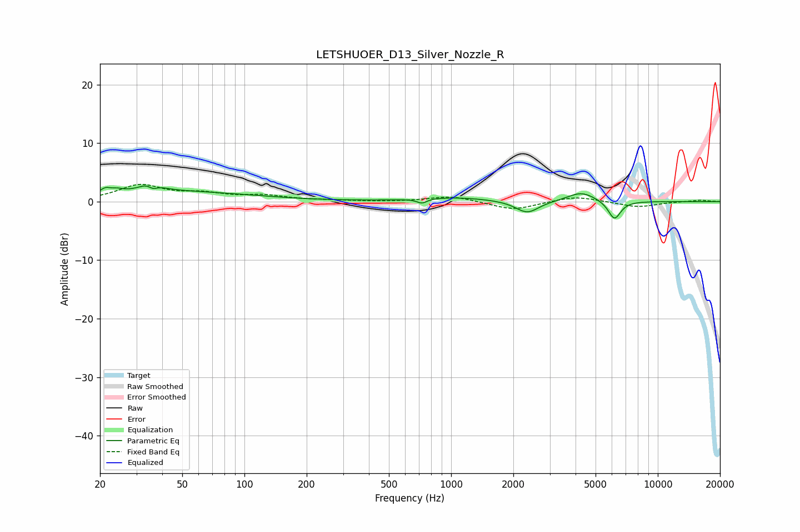

# LETSHUOER_D13_Silver_Nozzle_R
See [usage instructions](https://github.com/jaakkopasanen/AutoEq#usage) for more options and info.

### Parametric EQs
Apply preamp of -2.8 dB when using parametric equalizer.

|   # | Type    |   Fc (Hz) |    Q |   Gain (dB) |
|-----|---------|-----------|------|-------------|
|   1 | Peaking |        21 | 5.97 |         0.8 |
|   2 | Peaking |        24 | 4.87 |         0.5 |
|   3 | Peaking |        35 | 3.26 |         2.2 |
|   4 | Peaking |        36 | 5.42 |        -1.6 |
|   5 | Peaking |        45 | 0.38 |         1.7 |
|   6 | Peaking |       722 | 6    |        -0.8 |
|   7 | Peaking |      1043 | 0.82 |         0.7 |
|   8 | Peaking |      2335 | 2.52 |        -2.1 |
|   9 | Peaking |      4269 | 2.08 |         1.7 |
|  10 | Peaking |      6170 | 4.56 |        -3.2 |

### Fixed Band EQs
When using fixed band (also called graphic) equalizer, apply preamp of **-3.0 dB** (if available) and set gains manually with these parameters.

|   # | Type    |   Fc (Hz) |    Q |   Gain (dB) |
|-----|---------|-----------|------|-------------|
|   1 | Peaking |        31 | 1.41 |         2.7 |
|   2 | Peaking |        62 | 1.41 |         1.1 |
|   3 | Peaking |       125 | 1.41 |         0.9 |
|   4 | Peaking |       250 | 1.41 |         0.1 |
|   5 | Peaking |       500 | 1.41 |        -0   |
|   6 | Peaking |      1000 | 1.41 |         1   |
|   7 | Peaking |      2000 | 1.41 |        -1.5 |
|   8 | Peaking |      4000 | 1.41 |         1   |
|   9 | Peaking |      8000 | 1.41 |        -0.9 |
|  10 | Peaking |     16000 | 1.41 |         0.3 |

### Graphs

