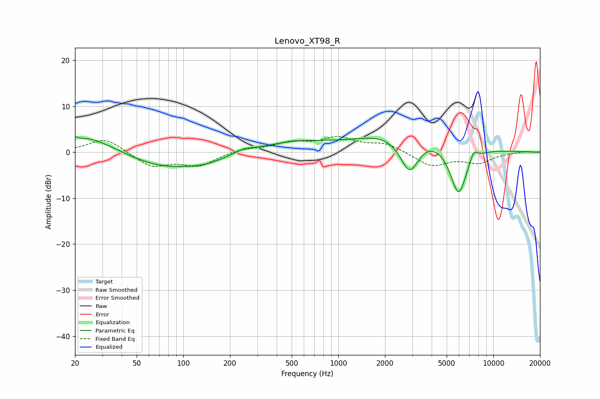

# Lenovo_XT98_R
See [usage instructions](https://github.com/jaakkopasanen/AutoEq#usage) for more options and info.

### Parametric EQs
Apply preamp of -3.5 dB when using parametric equalizer.

|   # | Type    |   Fc (Hz) |    Q |   Gain (dB) |
|-----|---------|-----------|------|-------------|
|   1 | Peaking |        21 | 0.58 |         4.5 |
|   2 | Peaking |        22 | 5.26 |        -0.4 |
|   3 | Peaking |        73 | 0.54 |        -3.8 |
|   4 | Peaking |       142 | 1.24 |        -0.9 |
|   5 | Peaking |       245 | 2.23 |         0.9 |
|   6 | Peaking |       516 | 0.68 |         2.1 |
|   7 | Peaking |      2880 | 1.99 |        -9.9 |
|   8 | Peaking |      3068 | 0.54 |         7   |
|   9 | Peaking |      5956 | 2.26 |       -12.2 |
|  10 | Peaking |      7457 | 4.91 |         2.4 |

### Fixed Band EQs
When using fixed band (also called graphic) equalizer, apply preamp of **-3.5 dB** (if available) and set gains manually with these parameters.

|   # | Type    |   Fc (Hz) |    Q |   Gain (dB) |
|-----|---------|-----------|------|-------------|
|   1 | Peaking |        31 | 1.41 |         3.2 |
|   2 | Peaking |        62 | 1.41 |        -3.1 |
|   3 | Peaking |       125 | 1.41 |        -2.8 |
|   4 | Peaking |       250 | 1.41 |         0.8 |
|   5 | Peaking |       500 | 1.41 |         1.9 |
|   6 | Peaking |      1000 | 1.41 |         2.9 |
|   7 | Peaking |      2000 | 1.41 |         1.8 |
|   8 | Peaking |      4000 | 1.41 |        -3   |
|   9 | Peaking |      8000 | 1.41 |        -2.1 |
|  10 | Peaking |     16000 | 1.41 |         0.2 |

### Graphs

