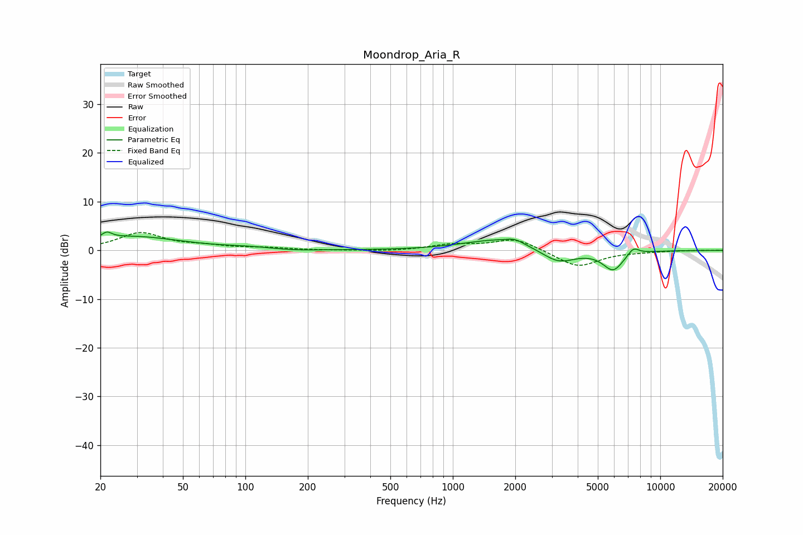

# Moondrop_Aria_R
See [usage instructions](https://github.com/jaakkopasanen/AutoEq#usage) for more options and info.

### Parametric EQs
Apply preamp of -3.9 dB when using parametric equalizer.

|   # | Type    |   Fc (Hz) |    Q |   Gain (dB) |
|-----|---------|-----------|------|-------------|
|   1 | Peaking |        21 | 6    |        -1.9 |
|   2 | Peaking |        21 | 5.94 |         3.2 |
|   3 | Peaking |        29 | 0.61 |         2.8 |
|   4 | Peaking |       104 | 1.11 |         0.4 |
|   5 | Peaking |       171 | 1.43 |        -0.3 |
|   6 | Peaking |      1693 | 0.83 |         2.3 |
|   7 | Peaking |      1994 | 3.53 |         0.8 |
|   8 | Peaking |      3230 | 1.71 |        -2.9 |
|   9 | Peaking |      5928 | 2.75 |        -4   |
|  10 | Peaking |      7420 | 4.93 |         1.5 |

### Fixed Band EQs
When using fixed band (also called graphic) equalizer, apply preamp of **-3.8 dB** (if available) and set gains manually with these parameters.

|   # | Type    |   Fc (Hz) |    Q |   Gain (dB) |
|-----|---------|-----------|------|-------------|
|   1 | Peaking |        31 | 1.41 |         3.5 |
|   2 | Peaking |        62 | 1.41 |         0.7 |
|   3 | Peaking |       125 | 1.41 |         0.4 |
|   4 | Peaking |       250 | 1.41 |        -0   |
|   5 | Peaking |       500 | 1.41 |        -0.2 |
|   6 | Peaking |      1000 | 1.41 |         1.1 |
|   7 | Peaking |      2000 | 1.41 |         2.4 |
|   8 | Peaking |      4000 | 1.41 |        -3.5 |
|   9 | Peaking |      8000 | 1.41 |        -0.2 |
|  10 | Peaking |     16000 | 1.41 |         0   |

### Graphs

