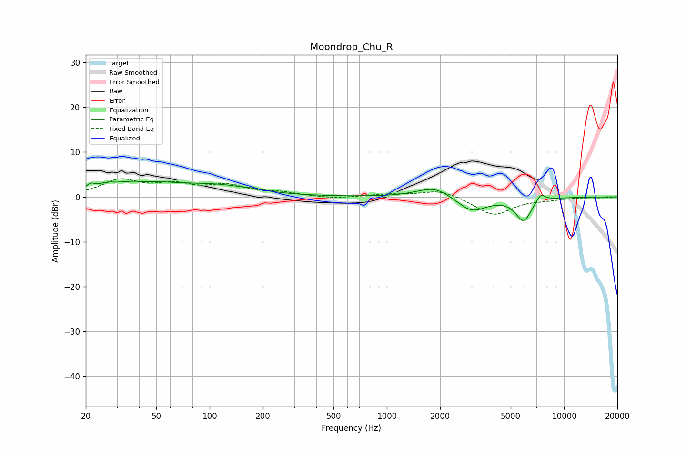

# Moondrop_Chu_R
See [usage instructions](https://github.com/jaakkopasanen/AutoEq#usage) for more options and info.

### Parametric EQs
Apply preamp of -3.6 dB when using parametric equalizer.

|   # | Type    |   Fc (Hz) |    Q |   Gain (dB) |
|-----|---------|-----------|------|-------------|
|   1 | Peaking |        21 | 5.96 |         1.2 |
|   2 | Peaking |        26 | 3.5  |         0.8 |
|   3 | Peaking |        41 | 0.84 |         3.7 |
|   4 | Peaking |        44 | 1.73 |        -1   |
|   5 | Peaking |       112 | 0.71 |         2.1 |
|   6 | Peaking |       183 | 3.1  |         0.2 |
|   7 | Peaking |      1859 | 1.47 |         2.5 |
|   8 | Peaking |      3011 | 1.71 |        -3.4 |
|   9 | Peaking |      5912 | 3.1  |        -5.2 |
|  10 | Peaking |      7378 | 5.18 |         1.9 |

### Fixed Band EQs
When using fixed band (also called graphic) equalizer, apply preamp of **-4.1 dB** (if available) and set gains manually with these parameters.

|   # | Type    |   Fc (Hz) |    Q |   Gain (dB) |
|-----|---------|-----------|------|-------------|
|   1 | Peaking |        31 | 1.41 |         3.5 |
|   2 | Peaking |        62 | 1.41 |         2.3 |
|   3 | Peaking |       125 | 1.41 |         2.3 |
|   4 | Peaking |       250 | 1.41 |         0.8 |
|   5 | Peaking |       500 | 1.41 |        -0.4 |
|   6 | Peaking |      1000 | 1.41 |         0.5 |
|   7 | Peaking |      2000 | 1.41 |         1.7 |
|   8 | Peaking |      4000 | 1.41 |        -4.1 |
|   9 | Peaking |      8000 | 1.41 |        -0.5 |
|  10 | Peaking |     16000 | 1.41 |        -0.2 |

### Graphs

