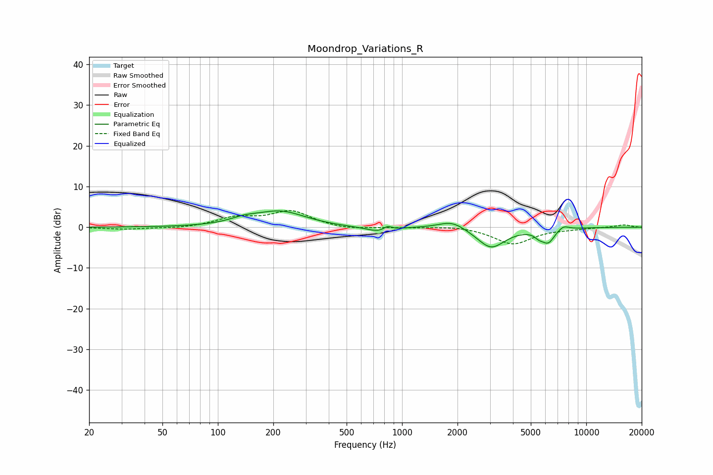

# Moondrop_Variations_R
See [usage instructions](https://github.com/jaakkopasanen/AutoEq#usage) for more options and info.

### Parametric EQs
Apply preamp of -4.1 dB when using parametric equalizer.

|   # | Type    |   Fc (Hz) |    Q |   Gain (dB) |
|-----|---------|-----------|------|-------------|
|   1 | Peaking |       138 | 1.81 |         1.1 |
|   2 | Peaking |       219 | 1.03 |         3.8 |
|   3 | Peaking |       491 | 1.08 |        -0.2 |
|   4 | Peaking |       761 | 2.09 |        -1.4 |
|   5 | Peaking |       834 | 6    |         1.1 |
|   6 | Peaking |      1870 | 1.95 |         2   |
|   7 | Peaking |      3038 | 1.85 |        -5.1 |
|   8 | Peaking |      5534 | 6    |        -1   |
|   9 | Peaking |      6209 | 3.89 |        -3.3 |
|  10 | Peaking |      7505 | 4.53 |         1.1 |

### Fixed Band EQs
When using fixed band (also called graphic) equalizer, apply preamp of **-4.2 dB** (if available) and set gains manually with these parameters.

|   # | Type    |   Fc (Hz) |    Q |   Gain (dB) |
|-----|---------|-----------|------|-------------|
|   1 | Peaking |        31 | 1.41 |        -0.5 |
|   2 | Peaking |        62 | 1.41 |        -0.3 |
|   3 | Peaking |       125 | 1.41 |         2.2 |
|   4 | Peaking |       250 | 1.41 |         3.8 |
|   5 | Peaking |       500 | 1.41 |        -0.7 |
|   6 | Peaking |      1000 | 1.41 |        -0.1 |
|   7 | Peaking |      2000 | 1.41 |         0.4 |
|   8 | Peaking |      4000 | 1.41 |        -4.1 |
|   9 | Peaking |      8000 | 1.41 |        -0.3 |
|  10 | Peaking |     16000 | 1.41 |         0.6 |

### Graphs

