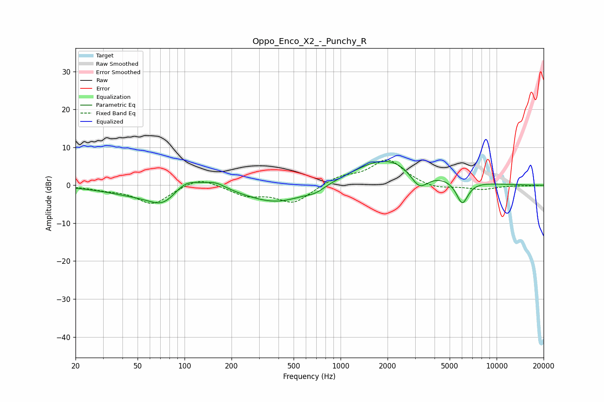

# Oppo_Enco_X2_-_Punchy_R
See [usage instructions](https://github.com/jaakkopasanen/AutoEq#usage) for more options and info.

### Parametric EQs
Apply preamp of -6.4 dB when using parametric equalizer.

|   # | Type    |   Fc (Hz) |    Q |   Gain (dB) |
|-----|---------|-----------|------|-------------|
|   1 | Peaking |        47 | 0.74 |        -2   |
|   2 | Peaking |        73 | 1.51 |        -4.4 |
|   3 | Peaking |       101 | 1.62 |         3.4 |
|   4 | Peaking |       157 | 1.94 |         1.9 |
|   5 | Peaking |       395 | 0.7  |        -4.8 |
|   6 | Peaking |       691 | 2.41 |        -1.2 |
|   7 | Peaking |      1860 | 0.83 |         2.2 |
|   8 | Peaking |      2185 | 0.54 |         5.5 |
|   9 | Peaking |      3196 | 2.32 |        -5.4 |
|  10 | Peaking |      6022 | 3.51 |        -6.3 |

### Fixed Band EQs
When using fixed band (also called graphic) equalizer, apply preamp of **-6.8 dB** (if available) and set gains manually with these parameters.

|   # | Type    |   Fc (Hz) |    Q |   Gain (dB) |
|-----|---------|-----------|------|-------------|
|   1 | Peaking |        31 | 1.41 |        -0.8 |
|   2 | Peaking |        62 | 1.41 |        -4.9 |
|   3 | Peaking |       125 | 1.41 |         2.5 |
|   4 | Peaking |       250 | 1.41 |        -2.5 |
|   5 | Peaking |       500 | 1.41 |        -4.6 |
|   6 | Peaking |      1000 | 1.41 |         2.1 |
|   7 | Peaking |      2000 | 1.41 |         6.7 |
|   8 | Peaking |      4000 | 1.41 |        -1.3 |
|   9 | Peaking |      8000 | 1.41 |        -1.1 |
|  10 | Peaking |     16000 | 1.41 |        -0.1 |

### Graphs

