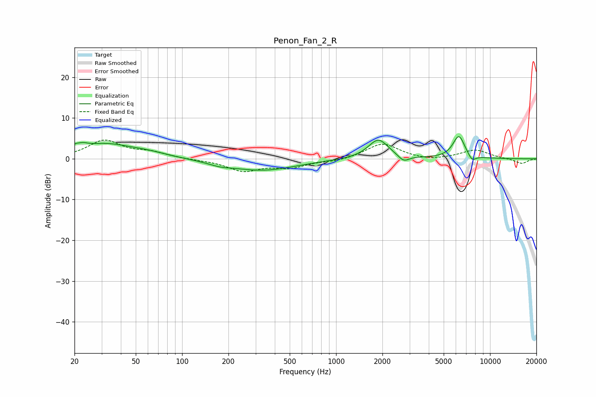

# Penon_Fan_2_R
See [usage instructions](https://github.com/jaakkopasanen/AutoEq#usage) for more options and info.

### Parametric EQs
Apply preamp of -5.5 dB when using parametric equalizer.

|   # | Type    |   Fc (Hz) |    Q |   Gain (dB) |
|-----|---------|-----------|------|-------------|
|   1 | Peaking |        21 | 4.59 |         3.9 |
|   2 | Peaking |        21 | 6    |        -2.5 |
|   3 | Peaking |        31 | 0.81 |         3.4 |
|   4 | Peaking |        60 | 1.08 |         0.9 |
|   5 | Peaking |       176 | 1.92 |        -0.7 |
|   6 | Peaking |       330 | 0.65 |        -2.8 |
|   7 | Peaking |      1882 | 2.14 |         4.8 |
|   8 | Peaking |      2745 | 4.04 |        -1.6 |
|   9 | Peaking |      6273 | 3.47 |         5.6 |
|  10 | Peaking |      7627 | 5.19 |        -1.6 |

### Fixed Band EQs
When using fixed band (also called graphic) equalizer, apply preamp of **-4.7 dB** (if available) and set gains manually with these parameters.

|   # | Type    |   Fc (Hz) |    Q |   Gain (dB) |
|-----|---------|-----------|------|-------------|
|   1 | Peaking |        31 | 1.41 |         4.4 |
|   2 | Peaking |        62 | 1.41 |         1.4 |
|   3 | Peaking |       125 | 1.41 |        -0.2 |
|   4 | Peaking |       250 | 1.41 |        -2.9 |
|   5 | Peaking |       500 | 1.41 |        -1.9 |
|   6 | Peaking |      1000 | 1.41 |        -0.6 |
|   7 | Peaking |      2000 | 1.41 |         3.8 |
|   8 | Peaking |      4000 | 1.41 |        -0.6 |
|   9 | Peaking |      8000 | 1.41 |         2.2 |
|  10 | Peaking |     16000 | 1.41 |        -1.2 |

### Graphs

