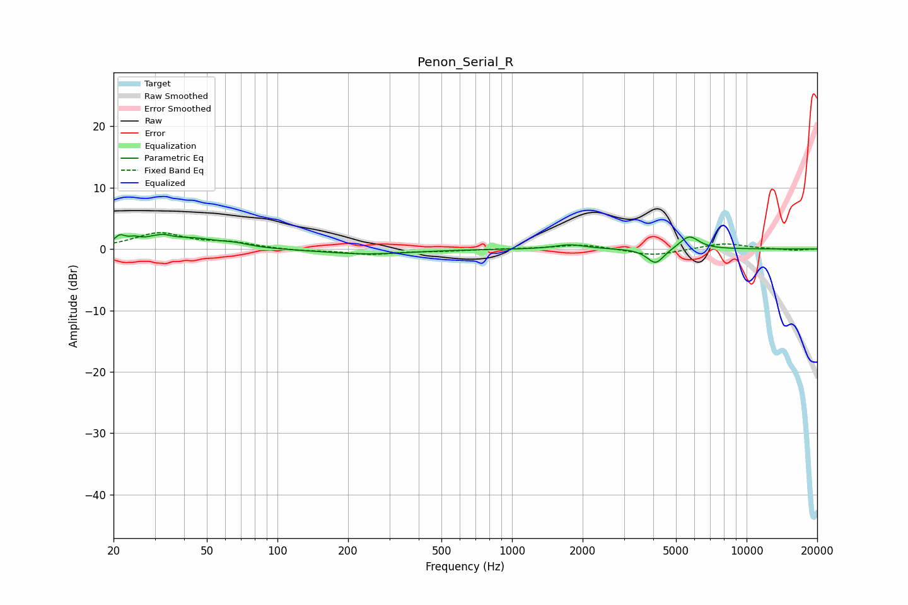

# Penon_Serial_R
See [usage instructions](https://github.com/jaakkopasanen/AutoEq#usage) for more options and info.

### Parametric EQs
Apply preamp of -2.5 dB when using parametric equalizer.

|   # | Type    |   Fc (Hz) |    Q |   Gain (dB) |
|-----|---------|-----------|------|-------------|
|   1 | Peaking |        21 | 5.95 |         1.5 |
|   2 | Peaking |        25 | 4.96 |         0.9 |
|   3 | Peaking |        31 | 5.29 |        -1.1 |
|   4 | Peaking |        31 | 3.73 |         2.3 |
|   5 | Peaking |        44 | 1.28 |         1.5 |
|   6 | Peaking |        66 | 2.54 |         0.5 |
|   7 | Peaking |       239 | 0.75 |        -0.8 |
|   8 | Peaking |      1763 | 2.24 |         0.7 |
|   9 | Peaking |      4093 | 3.89 |        -2.5 |
|  10 | Peaking |      5695 | 3.35 |         2.2 |

### Fixed Band EQs
When using fixed band (also called graphic) equalizer, apply preamp of **-2.8 dB** (if available) and set gains manually with these parameters.

|   # | Type    |   Fc (Hz) |    Q |   Gain (dB) |
|-----|---------|-----------|------|-------------|
|   1 | Peaking |        31 | 1.41 |         2.5 |
|   2 | Peaking |        62 | 1.41 |         0.9 |
|   3 | Peaking |       125 | 1.41 |        -0.3 |
|   4 | Peaking |       250 | 1.41 |        -0.8 |
|   5 | Peaking |       500 | 1.41 |        -0.3 |
|   6 | Peaking |      1000 | 1.41 |         0   |
|   7 | Peaking |      2000 | 1.41 |         0.8 |
|   8 | Peaking |      4000 | 1.41 |        -1.1 |
|   9 | Peaking |      8000 | 1.41 |         1   |
|  10 | Peaking |     16000 | 1.41 |        -0.2 |

### Graphs

