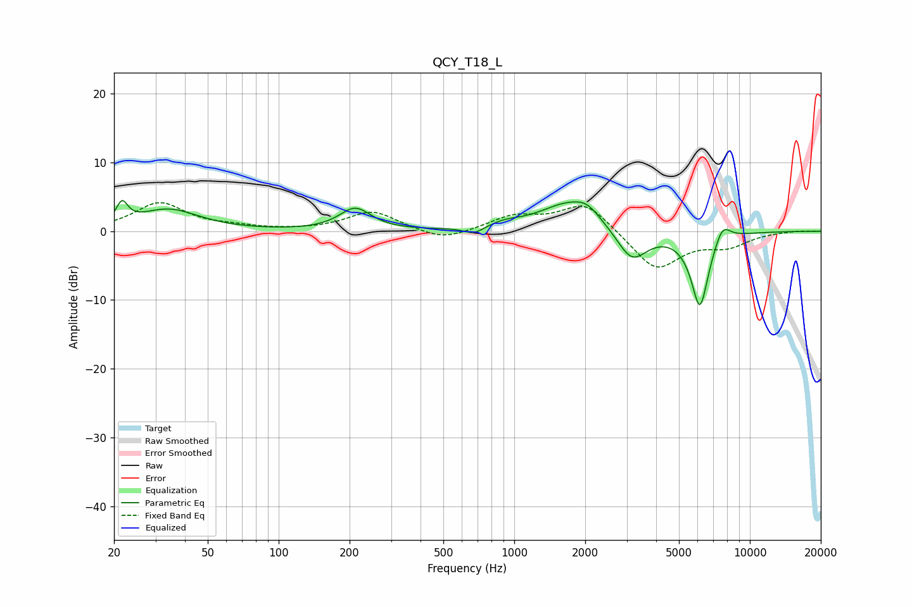

# QCY_T18_L
See [usage instructions](https://github.com/jaakkopasanen/AutoEq#usage) for more options and info.

### Parametric EQs
Apply preamp of -4.6 dB when using parametric equalizer.

|   # | Type    |   Fc (Hz) |    Q |   Gain (dB) |
|-----|---------|-----------|------|-------------|
|   1 | Peaking |        22 | 5.97 |         2.9 |
|   2 | Peaking |        34 | 1.1  |         3.1 |
|   3 | Peaking |       211 | 2.11 |         3.2 |
|   4 | Peaking |       676 | 3.31 |        -1.1 |
|   5 | Peaking |       906 | 2.2  |         0.7 |
|   6 | Peaking |      1738 | 1.09 |         4.2 |
|   7 | Peaking |      2044 | 2.93 |         1.2 |
|   8 | Peaking |      3154 | 2.14 |        -4.9 |
|   9 | Peaking |      6137 | 3.55 |       -11.1 |
|  10 | Peaking |      7638 | 3.88 |         2.8 |

### Fixed Band EQs
When using fixed band (also called graphic) equalizer, apply preamp of **-4.2 dB** (if available) and set gains manually with these parameters.

|   # | Type    |   Fc (Hz) |    Q |   Gain (dB) |
|-----|---------|-----------|------|-------------|
|   1 | Peaking |        31 | 1.41 |         4   |
|   2 | Peaking |        62 | 1.41 |         0.5 |
|   3 | Peaking |       125 | 1.41 |         0   |
|   4 | Peaking |       250 | 1.41 |         2.9 |
|   5 | Peaking |       500 | 1.41 |        -1.5 |
|   6 | Peaking |      1000 | 1.41 |         2   |
|   7 | Peaking |      2000 | 1.41 |         4.3 |
|   8 | Peaking |      4000 | 1.41 |        -5.7 |
|   9 | Peaking |      8000 | 1.41 |        -1.9 |
|  10 | Peaking |     16000 | 1.41 |         0.1 |

### Graphs

