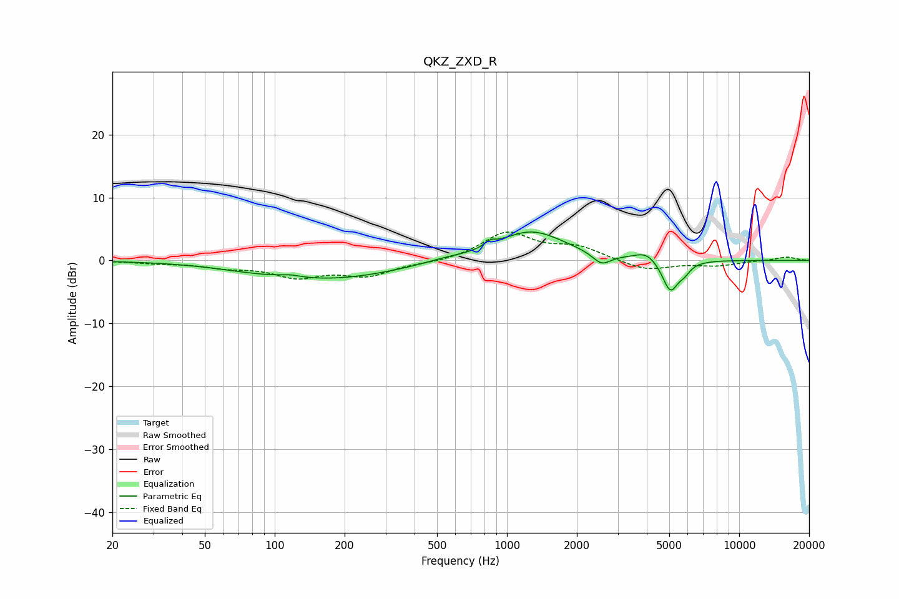

# QKZ_ZXD_R
See [usage instructions](https://github.com/jaakkopasanen/AutoEq#usage) for more options and info.

### Parametric EQs
Apply preamp of -4.6 dB when using parametric equalizer.

|   # | Type    |   Fc (Hz) |    Q |   Gain (dB) |
|-----|---------|-----------|------|-------------|
|   1 | Peaking |        76 | 0.96 |        -0.3 |
|   2 | Peaking |       117 | 3.17 |         0.4 |
|   3 | Peaking |       169 | 0.47 |        -2.9 |
|   4 | Peaking |       531 | 1.67 |         0.4 |
|   5 | Peaking |       847 | 6    |         0.8 |
|   6 | Peaking |      1268 | 0.97 |         4.7 |
|   7 | Peaking |      2557 | 3.65 |        -1.8 |
|   8 | Peaking |      3990 | 2.93 |         1.4 |
|   9 | Peaking |      5054 | 3.94 |        -5.1 |
|  10 | Peaking |      5818 | 5.57 |        -1.1 |

### Fixed Band EQs
When using fixed band (also called graphic) equalizer, apply preamp of **-4.6 dB** (if available) and set gains manually with these parameters.

|   # | Type    |   Fc (Hz) |    Q |   Gain (dB) |
|-----|---------|-----------|------|-------------|
|   1 | Peaking |        31 | 1.41 |        -0.4 |
|   2 | Peaking |        62 | 1.41 |        -0.9 |
|   3 | Peaking |       125 | 1.41 |        -2.4 |
|   4 | Peaking |       250 | 1.41 |        -2.3 |
|   5 | Peaking |       500 | 1.41 |        -0.4 |
|   6 | Peaking |      1000 | 1.41 |         4.4 |
|   7 | Peaking |      2000 | 1.41 |         2   |
|   8 | Peaking |      4000 | 1.41 |        -1.6 |
|   9 | Peaking |      8000 | 1.41 |        -0.8 |
|  10 | Peaking |     16000 | 1.41 |         0.6 |

### Graphs

