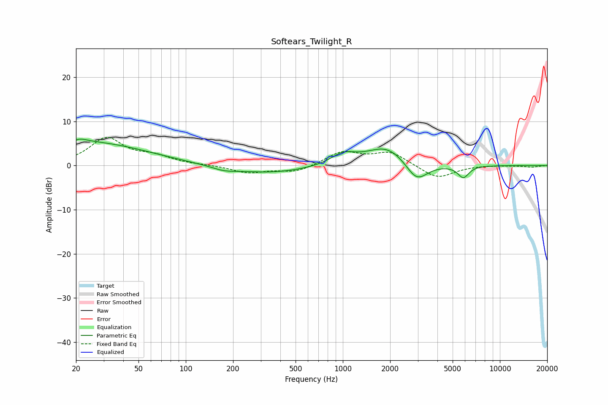

# Softears_Twilight_R
See [usage instructions](https://github.com/jaakkopasanen/AutoEq#usage) for more options and info.

### Parametric EQs
Apply preamp of -6.1 dB when using parametric equalizer.

|   # | Type    |   Fc (Hz) |    Q |   Gain (dB) |
|-----|---------|-----------|------|-------------|
|   1 | Peaking |        20 | 1.23 |         1.1 |
|   2 | Peaking |        22 | 5.61 |         3.3 |
|   3 | Peaking |        22 | 6    |        -2.8 |
|   4 | Peaking |        28 | 0.43 |         4.6 |
|   5 | Peaking |       175 | 1.88 |        -0.8 |
|   6 | Peaking |       340 | 0.55 |        -1.7 |
|   7 | Peaking |      1003 | 1.79 |         2.4 |
|   8 | Peaking |      1909 | 1.1  |         4.5 |
|   9 | Peaking |      2950 | 2.01 |        -4.7 |
|  10 | Peaking |      5849 | 3.91 |        -2.7 |

### Fixed Band EQs
When using fixed band (also called graphic) equalizer, apply preamp of **-6.5 dB** (if available) and set gains manually with these parameters.

|   # | Type    |   Fc (Hz) |    Q |   Gain (dB) |
|-----|---------|-----------|------|-------------|
|   1 | Peaking |        31 | 1.41 |         6.1 |
|   2 | Peaking |        62 | 1.41 |         1.8 |
|   3 | Peaking |       125 | 1.41 |         0.1 |
|   4 | Peaking |       250 | 1.41 |        -1.6 |
|   5 | Peaking |       500 | 1.41 |        -1.5 |
|   6 | Peaking |      1000 | 1.41 |         3   |
|   7 | Peaking |      2000 | 1.41 |         3   |
|   8 | Peaking |      4000 | 1.41 |        -3   |
|   9 | Peaking |      8000 | 1.41 |         0.1 |
|  10 | Peaking |     16000 | 1.41 |        -0.4 |

### Graphs

