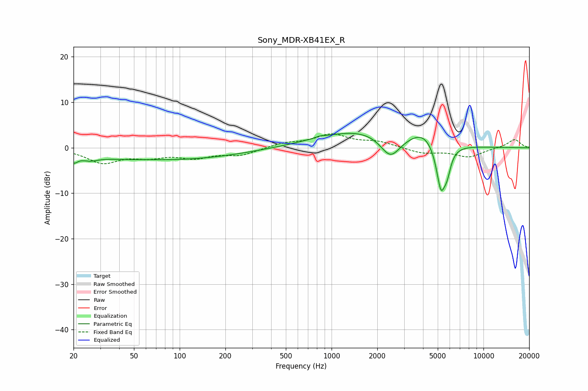

# Sony_MDR-XB41EX_R
See [usage instructions](https://github.com/jaakkopasanen/AutoEq#usage) for more options and info.

### Parametric EQs
Apply preamp of -3.3 dB when using parametric equalizer.

|   # | Type    |   Fc (Hz) |    Q |   Gain (dB) |
|-----|---------|-----------|------|-------------|
|   1 | Peaking |        20 | 5.12 |        -1.8 |
|   2 | Peaking |        25 | 2.44 |        -1.2 |
|   3 | Peaking |        38 | 1.18 |        -0.4 |
|   4 | Peaking |        90 | 0.32 |        -2.6 |
|   5 | Peaking |       838 | 4.48 |         0.3 |
|   6 | Peaking |      1610 | 0.48 |         3.9 |
|   7 | Peaking |      2441 | 2.1  |        -5.2 |
|   8 | Peaking |      4060 | 1.61 |         2.7 |
|   9 | Peaking |      5251 | 4.3  |       -10.3 |
|  10 | Peaking |      5770 | 5.97 |        -3.5 |

### Fixed Band EQs
When using fixed band (also called graphic) equalizer, apply preamp of **-3.2 dB** (if available) and set gains manually with these parameters.

|   # | Type    |   Fc (Hz) |    Q |   Gain (dB) |
|-----|---------|-----------|------|-------------|
|   1 | Peaking |        31 | 1.41 |        -3.1 |
|   2 | Peaking |        62 | 1.41 |        -1.6 |
|   3 | Peaking |       125 | 1.41 |        -1.9 |
|   4 | Peaking |       250 | 1.41 |        -1.5 |
|   5 | Peaking |       500 | 1.41 |         1   |
|   6 | Peaking |      1000 | 1.41 |         2.8 |
|   7 | Peaking |      2000 | 1.41 |         1.2 |
|   8 | Peaking |      4000 | 1.41 |        -1.2 |
|   9 | Peaking |      8000 | 1.41 |        -2   |
|  10 | Peaking |     16000 | 1.41 |         1.9 |

### Graphs

