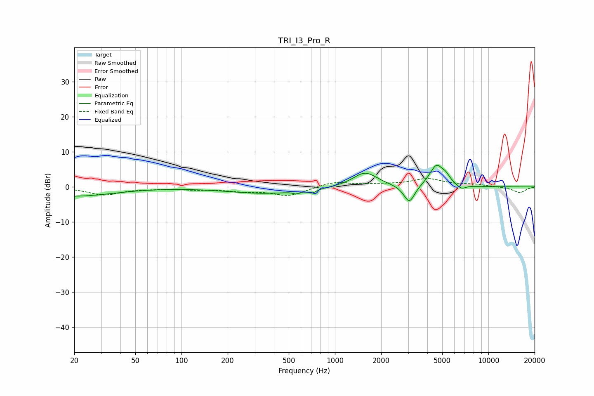

# TRI_I3_Pro_R
See [usage instructions](https://github.com/jaakkopasanen/AutoEq#usage) for more options and info.

### Parametric EQs
Apply preamp of -6.3 dB when using parametric equalizer.

|   # | Type    |   Fc (Hz) |    Q |   Gain (dB) |
|-----|---------|-----------|------|-------------|
|   1 | Peaking |        20 | 0.56 |        -2.6 |
|   2 | Peaking |       361 | 0.56 |        -1.9 |
|   3 | Peaking |       565 | 5.91 |        -0.9 |
|   4 | Peaking |       620 | 2.5  |         0.4 |
|   5 | Peaking |       707 | 4.96 |        -1.2 |
|   6 | Peaking |      1574 | 1.76 |         4.3 |
|   7 | Peaking |      3052 | 3.92 |        -5.2 |
|   8 | Peaking |      4595 | 3.06 |         6.1 |
|   9 | Peaking |      5302 | 5.4  |         1.5 |
|  10 | Peaking |      6659 | 4.68 |        -1.3 |

### Fixed Band EQs
When using fixed band (also called graphic) equalizer, apply preamp of **-2.5 dB** (if available) and set gains manually with these parameters.

|   # | Type    |   Fc (Hz) |    Q |   Gain (dB) |
|-----|---------|-----------|------|-------------|
|   1 | Peaking |        31 | 1.41 |        -2.2 |
|   2 | Peaking |        62 | 1.41 |        -0.3 |
|   3 | Peaking |       125 | 1.41 |        -0.6 |
|   4 | Peaking |       250 | 1.41 |        -1   |
|   5 | Peaking |       500 | 1.41 |        -2.5 |
|   6 | Peaking |      1000 | 1.41 |         1.5 |
|   7 | Peaking |      2000 | 1.41 |         0.5 |
|   8 | Peaking |      4000 | 1.41 |         2.2 |
|   9 | Peaking |      8000 | 1.41 |         0.6 |
|  10 | Peaking |     16000 | 1.41 |        -1.6 |

### Graphs

