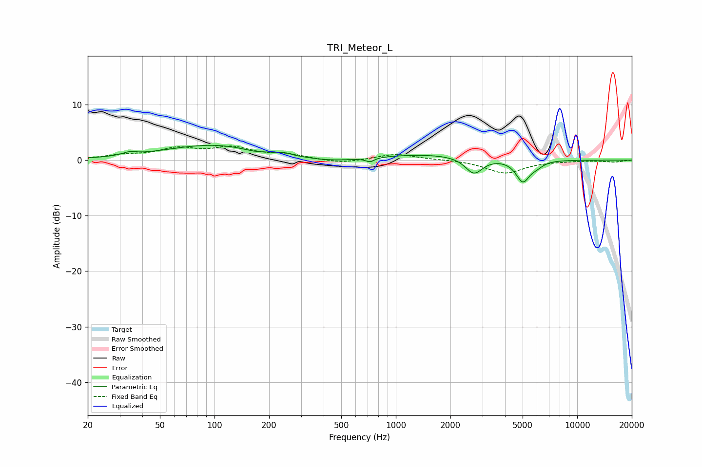

# TRI_Meteor_L
See [usage instructions](https://github.com/jaakkopasanen/AutoEq#usage) for more options and info.

### Parametric EQs
Apply preamp of -2.8 dB when using parametric equalizer.

|   # | Type    |   Fc (Hz) |    Q |   Gain (dB) |
|-----|---------|-----------|------|-------------|
|   1 | Peaking |        34 | 3.68 |         0.6 |
|   2 | Peaking |        97 | 0.53 |         2.7 |
|   3 | Peaking |       163 | 2.49 |        -0.4 |
|   4 | Peaking |       242 | 3.83 |         0.4 |
|   5 | Peaking |       450 | 0.94 |        -0.7 |
|   6 | Peaking |       721 | 6    |        -0.7 |
|   7 | Peaking |      1589 | 0.45 |         1.1 |
|   8 | Peaking |      2695 | 2.94 |        -3   |
|   9 | Peaking |      5014 | 3.66 |        -3.9 |
|  10 | Peaking |      5993 | 3.96 |        -0.7 |

### Fixed Band EQs
When using fixed band (also called graphic) equalizer, apply preamp of **-2.6 dB** (if available) and set gains manually with these parameters.

|   # | Type    |   Fc (Hz) |    Q |   Gain (dB) |
|-----|---------|-----------|------|-------------|
|   1 | Peaking |        31 | 1.41 |         0.7 |
|   2 | Peaking |        62 | 1.41 |         1.9 |
|   3 | Peaking |       125 | 1.41 |         2   |
|   4 | Peaking |       250 | 1.41 |         0.9 |
|   5 | Peaking |       500 | 1.41 |        -0.6 |
|   6 | Peaking |      1000 | 1.41 |         1.1 |
|   7 | Peaking |      2000 | 1.41 |         0.1 |
|   8 | Peaking |      4000 | 1.41 |        -2.3 |
|   9 | Peaking |      8000 | 1.41 |        -0.1 |
|  10 | Peaking |     16000 | 1.41 |        -0.3 |

### Graphs

