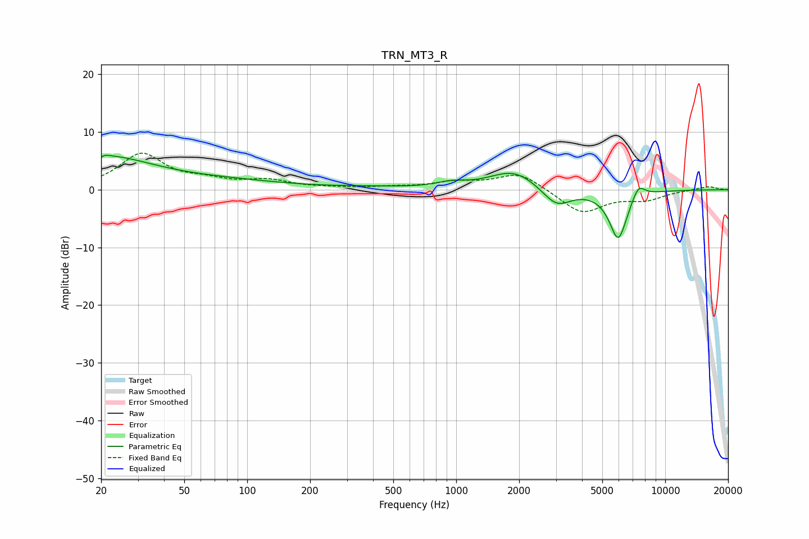

# TRN_MT3_R
See [usage instructions](https://github.com/jaakkopasanen/AutoEq#usage) for more options and info.

### Parametric EQs
Apply preamp of -6.1 dB when using parametric equalizer.

|   # | Type    |   Fc (Hz) |    Q |   Gain (dB) |
|-----|---------|-----------|------|-------------|
|   1 | Peaking |        20 | 0.57 |         5.7 |
|   2 | Peaking |        20 | 5.69 |        -3.5 |
|   3 | Peaking |        20 | 5.84 |         3.3 |
|   4 | Peaking |        82 | 0.5  |         1.2 |
|   5 | Peaking |       380 | 0.72 |         0.3 |
|   6 | Peaking |       946 | 2.04 |         0.8 |
|   7 | Peaking |      1891 | 1.22 |         3.4 |
|   8 | Peaking |      3018 | 2.03 |        -3.3 |
|   9 | Peaking |      5963 | 3.14 |        -8.6 |
|  10 | Peaking |      7440 | 4.23 |         2.5 |

### Fixed Band EQs
When using fixed band (also called graphic) equalizer, apply preamp of **-6.4 dB** (if available) and set gains manually with these parameters.

|   # | Type    |   Fc (Hz) |    Q |   Gain (dB) |
|-----|---------|-----------|------|-------------|
|   1 | Peaking |        31 | 1.41 |         6.1 |
|   2 | Peaking |        62 | 1.41 |         1.2 |
|   3 | Peaking |       125 | 1.41 |         1.4 |
|   4 | Peaking |       250 | 1.41 |         0.2 |
|   5 | Peaking |       500 | 1.41 |         0.3 |
|   6 | Peaking |      1000 | 1.41 |         1.2 |
|   7 | Peaking |      2000 | 1.41 |         3   |
|   8 | Peaking |      4000 | 1.41 |        -4.1 |
|   9 | Peaking |      8000 | 1.41 |        -1.5 |
|  10 | Peaking |     16000 | 1.41 |         0.6 |

### Graphs

