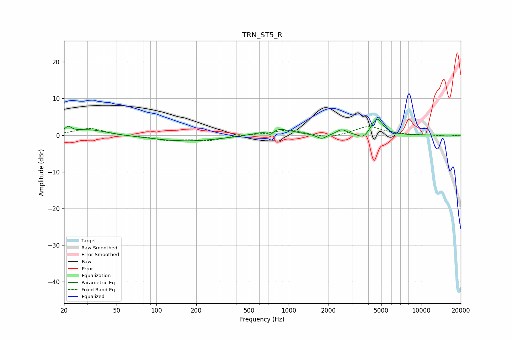

# TRN_ST5_R
See [usage instructions](https://github.com/jaakkopasanen/AutoEq#usage) for more options and info.

### Parametric EQs
Apply preamp of -4.5 dB when using parametric equalizer.

|   # | Type    |   Fc (Hz) |    Q |   Gain (dB) |
|-----|---------|-----------|------|-------------|
|   1 | Peaking |        22 | 5.88 |         1.5 |
|   2 | Peaking |        31 | 1.03 |         1.6 |
|   3 | Peaking |       169 | 0.54 |        -1.6 |
|   4 | Peaking |       531 | 1.29 |         0.1 |
|   5 | Peaking |       727 | 6    |        -1.4 |
|   6 | Peaking |       812 | 1.41 |         2.1 |
|   7 | Peaking |      1775 | 3.86 |        -1.3 |
|   8 | Peaking |      2516 | 3.63 |         1.5 |
|   9 | Peaking |      3665 | 3.48 |        -1.6 |
|  10 | Peaking |      4646 | 3.27 |         4.7 |

### Fixed Band EQs
When using fixed band (also called graphic) equalizer, apply preamp of **-2.4 dB** (if available) and set gains manually with these parameters.

|   # | Type    |   Fc (Hz) |    Q |   Gain (dB) |
|-----|---------|-----------|------|-------------|
|   1 | Peaking |        31 | 1.41 |         1.9 |
|   2 | Peaking |        62 | 1.41 |        -0.2 |
|   3 | Peaking |       125 | 1.41 |        -1.3 |
|   4 | Peaking |       250 | 1.41 |        -1.3 |
|   5 | Peaking |       500 | 1.41 |         0.2 |
|   6 | Peaking |      1000 | 1.41 |         1.5 |
|   7 | Peaking |      2000 | 1.41 |        -0.9 |
|   8 | Peaking |      4000 | 1.41 |         2.4 |
|   9 | Peaking |      8000 | 1.41 |         0   |
|  10 | Peaking |     16000 | 1.41 |        -0.3 |

### Graphs

