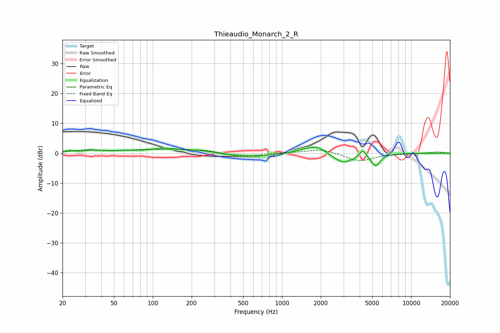

# Thieaudio_Monarch_2_R
See [usage instructions](https://github.com/jaakkopasanen/AutoEq#usage) for more options and info.

### Parametric EQs
Apply preamp of -2.1 dB when using parametric equalizer.

|   # | Type    |   Fc (Hz) |    Q |   Gain (dB) |
|-----|---------|-----------|------|-------------|
|   1 | Peaking |        23 | 4.73 |         0.5 |
|   2 | Peaking |        34 | 2.15 |         0.7 |
|   3 | Peaking |       138 | 0.44 |         1.4 |
|   4 | Peaking |       375 | 1.92 |        -0.6 |
|   5 | Peaking |       627 | 1.16 |        -1.2 |
|   6 | Peaking |      1451 | 2.13 |         0.7 |
|   7 | Peaking |      1860 | 2.03 |         2.4 |
|   8 | Peaking |      2980 | 1.9  |        -3.4 |
|   9 | Peaking |      4220 | 6    |         2.4 |
|  10 | Peaking |      5313 | 4.13 |        -4   |

### Fixed Band EQs
When using fixed band (also called graphic) equalizer, apply preamp of **-1.8 dB** (if available) and set gains manually with these parameters.

|   # | Type    |   Fc (Hz) |    Q |   Gain (dB) |
|-----|---------|-----------|------|-------------|
|   1 | Peaking |        31 | 1.41 |         1   |
|   2 | Peaking |        62 | 1.41 |         0.5 |
|   3 | Peaking |       125 | 1.41 |         1.5 |
|   4 | Peaking |       250 | 1.41 |         0.9 |
|   5 | Peaking |       500 | 1.41 |        -1.4 |
|   6 | Peaking |      1000 | 1.41 |         0.2 |
|   7 | Peaking |      2000 | 1.41 |         1.4 |
|   8 | Peaking |      4000 | 1.41 |        -2.7 |
|   9 | Peaking |      8000 | 1.41 |        -0.2 |
|  10 | Peaking |     16000 | 1.41 |         0.4 |

### Graphs

