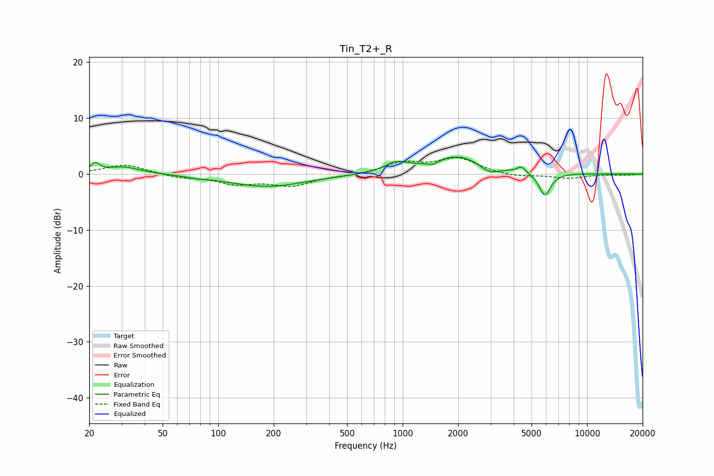

# Tin_T2+_R
See [usage instructions](https://github.com/jaakkopasanen/AutoEq#usage) for more options and info.

### Parametric EQs
Apply preamp of -3.1 dB when using parametric equalizer.

|   # | Type    |   Fc (Hz) |    Q |   Gain (dB) |
|-----|---------|-----------|------|-------------|
|   1 | Peaking |        22 | 5.96 |         1.5 |
|   2 | Peaking |        30 | 1.47 |         1.3 |
|   3 | Peaking |        76 | 3.89 |        -0.2 |
|   4 | Peaking |       184 | 0.67 |        -2.3 |
|   5 | Peaking |       919 | 2.56 |         1.5 |
|   6 | Peaking |      1459 | 4.24 |        -0.8 |
|   7 | Peaking |      1991 | 0.89 |         3.4 |
|   8 | Peaking |      2953 | 2.57 |        -1.6 |
|   9 | Peaking |      4412 | 6    |         1   |
|  10 | Peaking |      5903 | 4.28 |        -4.1 |

### Fixed Band EQs
When using fixed band (also called graphic) equalizer, apply preamp of **-3.0 dB** (if available) and set gains manually with these parameters.

|   # | Type    |   Fc (Hz) |    Q |   Gain (dB) |
|-----|---------|-----------|------|-------------|
|   1 | Peaking |        31 | 1.41 |         1.7 |
|   2 | Peaking |        62 | 1.41 |        -0.6 |
|   3 | Peaking |       125 | 1.41 |        -1.6 |
|   4 | Peaking |       250 | 1.41 |        -2   |
|   5 | Peaking |       500 | 1.41 |        -0.3 |
|   6 | Peaking |      1000 | 1.41 |         1.9 |
|   7 | Peaking |      2000 | 1.41 |         2.7 |
|   8 | Peaking |      4000 | 1.41 |        -0.6 |
|   9 | Peaking |      8000 | 1.41 |        -0.8 |
|  10 | Peaking |     16000 | 1.41 |        -0.2 |

### Graphs

