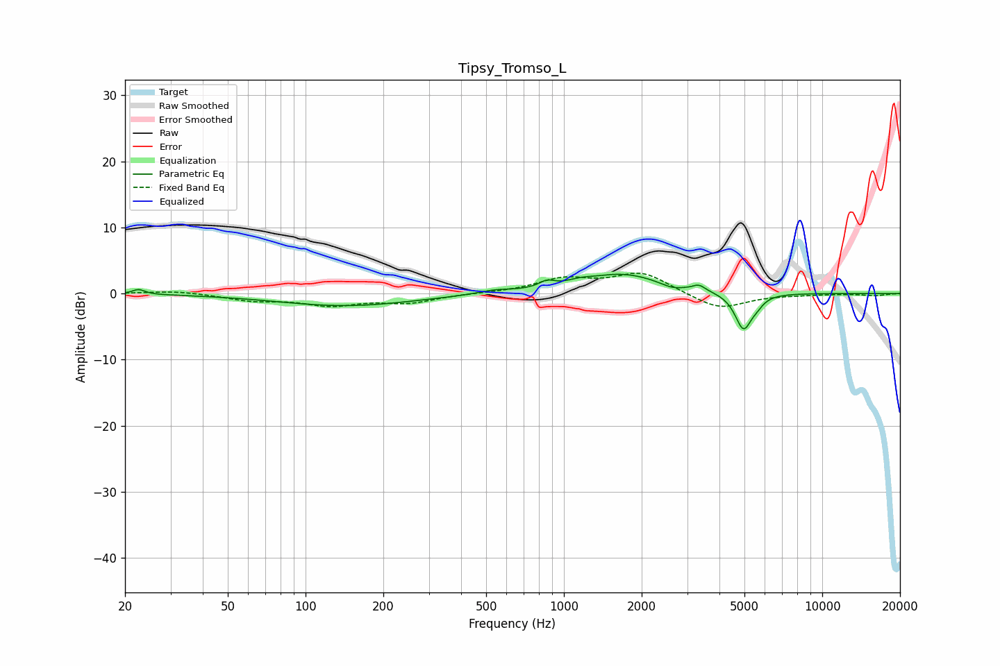

# Tipsy_Tromso_L
See [usage instructions](https://github.com/jaakkopasanen/AutoEq#usage) for more options and info.

### Parametric EQs
Apply preamp of -3.0 dB when using parametric equalizer.

|   # | Type    |   Fc (Hz) |    Q |   Gain (dB) |
|-----|---------|-----------|------|-------------|
|   1 | Peaking |        23 | 5.94 |         0.7 |
|   2 | Peaking |       143 | 0.54 |        -1.9 |
|   3 | Peaking |       539 | 2.14 |         0.5 |
|   4 | Peaking |       859 | 4.74 |         0.9 |
|   5 | Peaking |      1148 | 3.07 |         0.4 |
|   6 | Peaking |      1679 | 0.91 |         2.9 |
|   7 | Peaking |      2611 | 3.23 |        -0.7 |
|   8 | Peaking |      3333 | 6    |         0.8 |
|   9 | Peaking |      4958 | 4.26 |        -5.6 |
|  10 | Peaking |      5603 | 5.96 |        -0.7 |

### Fixed Band EQs
When using fixed band (also called graphic) equalizer, apply preamp of **-3.2 dB** (if available) and set gains manually with these parameters.

|   # | Type    |   Fc (Hz) |    Q |   Gain (dB) |
|-----|---------|-----------|------|-------------|
|   1 | Peaking |        31 | 1.41 |         0.4 |
|   2 | Peaking |        62 | 1.41 |        -1   |
|   3 | Peaking |       125 | 1.41 |        -1.6 |
|   4 | Peaking |       250 | 1.41 |        -1.3 |
|   5 | Peaking |       500 | 1.41 |         0   |
|   6 | Peaking |      1000 | 1.41 |         2.1 |
|   7 | Peaking |      2000 | 1.41 |         3.1 |
|   8 | Peaking |      4000 | 1.41 |        -2.5 |
|   9 | Peaking |      8000 | 1.41 |        -0.1 |
|  10 | Peaking |     16000 | 1.41 |        -0.3 |

### Graphs

