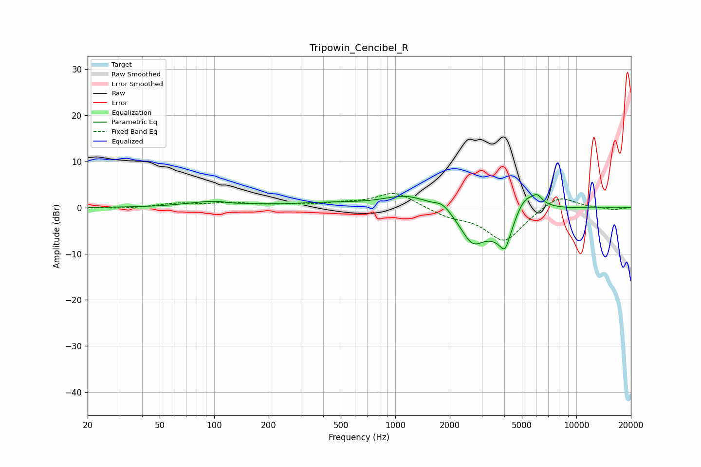

# Tripowin_Cencibel_R
See [usage instructions](https://github.com/jaakkopasanen/AutoEq#usage) for more options and info.

### Parametric EQs
Apply preamp of -2.9 dB when using parametric equalizer.

|   # | Type    |   Fc (Hz) |    Q |   Gain (dB) |
|-----|---------|-----------|------|-------------|
|   1 | Peaking |       101 | 0.97 |         1.3 |
|   2 | Peaking |       128 | 3.11 |        -0.3 |
|   3 | Peaking |       426 | 0.67 |         0.9 |
|   4 | Peaking |      1161 | 1.12 |         2.7 |
|   5 | Peaking |      1829 | 3.16 |         1.6 |
|   6 | Peaking |      2667 | 2.09 |        -6.3 |
|   7 | Peaking |      4036 | 6    |        -2.9 |
|   8 | Peaking |      4074 | 1.52 |        -8.8 |
|   9 | Peaking |      5092 | 1.77 |         7.1 |
|  10 | Peaking |      6086 | 5.22 |         1.6 |

### Fixed Band EQs
When using fixed band (also called graphic) equalizer, apply preamp of **-3.2 dB** (if available) and set gains manually with these parameters.

|   # | Type    |   Fc (Hz) |    Q |   Gain (dB) |
|-----|---------|-----------|------|-------------|
|   1 | Peaking |        31 | 1.41 |        -0.2 |
|   2 | Peaking |        62 | 1.41 |         0.9 |
|   3 | Peaking |       125 | 1.41 |         0.9 |
|   4 | Peaking |       250 | 1.41 |         0.4 |
|   5 | Peaking |       500 | 1.41 |         0.8 |
|   6 | Peaking |      1000 | 1.41 |         3.4 |
|   7 | Peaking |      2000 | 1.41 |        -1.6 |
|   8 | Peaking |      4000 | 1.41 |        -7.3 |
|   9 | Peaking |      8000 | 1.41 |         3   |
|  10 | Peaking |     16000 | 1.41 |        -0.5 |

### Graphs

