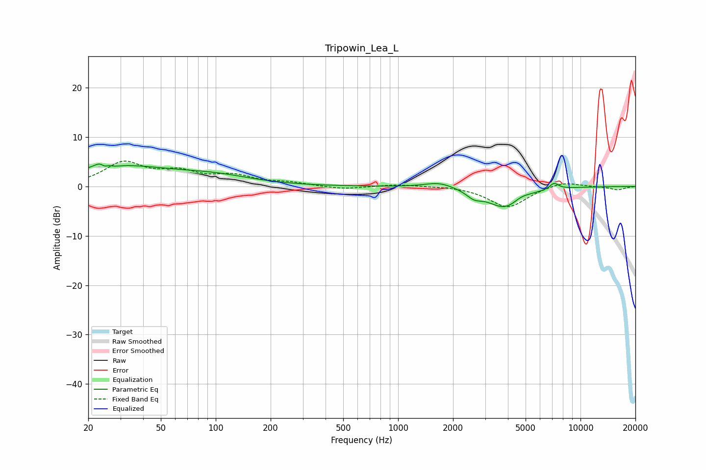

# Tripowin_Lea_L
See [usage instructions](https://github.com/jaakkopasanen/AutoEq#usage) for more options and info.

### Parametric EQs
Apply preamp of -4.6 dB when using parametric equalizer.

|   # | Type    |   Fc (Hz) |    Q |   Gain (dB) |
|-----|---------|-----------|------|-------------|
|   1 | Peaking |        24 | 4.42 |         4.2 |
|   2 | Peaking |        25 | 5.94 |        -3.5 |
|   3 | Peaking |        27 | 4.3  |        -0.7 |
|   4 | Peaking |        30 | 0.49 |         3.8 |
|   5 | Peaking |       101 | 0.7  |         1.6 |
|   6 | Peaking |      1681 | 1.82 |         1.1 |
|   7 | Peaking |      2613 | 3.35 |        -1.4 |
|   8 | Peaking |      3834 | 1.49 |        -4.2 |
|   9 | Peaking |      4733 | 3.24 |         0.7 |
|  10 | Peaking |      7168 | 5.45 |         1.3 |

### Fixed Band EQs
When using fixed band (also called graphic) equalizer, apply preamp of **-5.2 dB** (if available) and set gains manually with these parameters.

|   # | Type    |   Fc (Hz) |    Q |   Gain (dB) |
|-----|---------|-----------|------|-------------|
|   1 | Peaking |        31 | 1.41 |         4.6 |
|   2 | Peaking |        62 | 1.41 |         2.5 |
|   3 | Peaking |       125 | 1.41 |         1.9 |
|   4 | Peaking |       250 | 1.41 |         0.7 |
|   5 | Peaking |       500 | 1.41 |        -0.6 |
|   6 | Peaking |      1000 | 1.41 |         0.4 |
|   7 | Peaking |      2000 | 1.41 |         0.1 |
|   8 | Peaking |      4000 | 1.41 |        -4.3 |
|   9 | Peaking |      8000 | 1.41 |         1.1 |
|  10 | Peaking |     16000 | 1.41 |        -0.7 |

### Graphs

