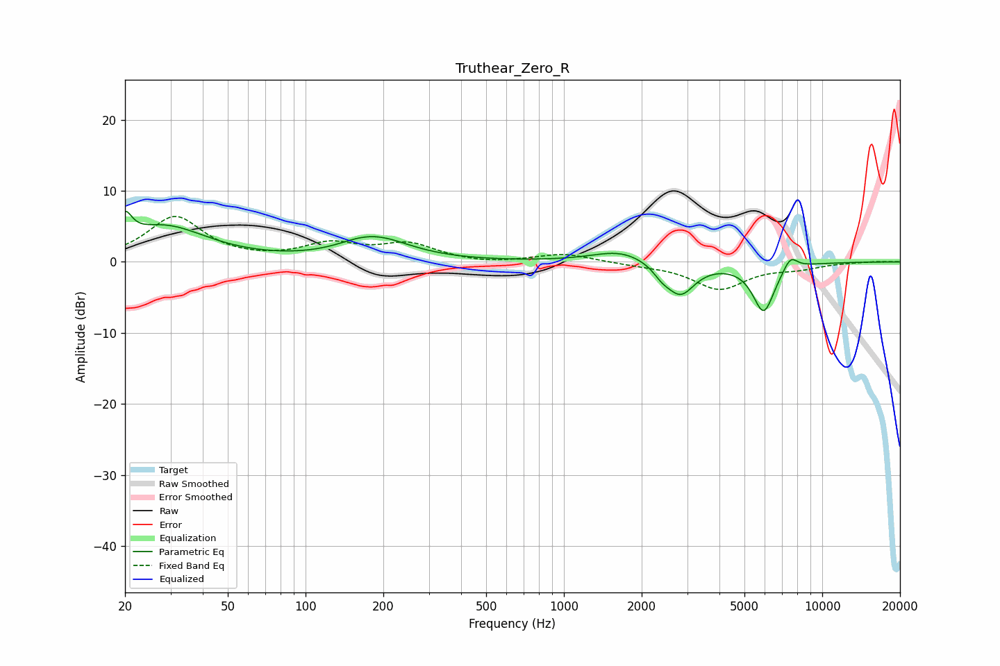

# Truthear_Zero_R
See [usage instructions](https://github.com/jaakkopasanen/AutoEq#usage) for more options and info.

### Parametric EQs
Apply preamp of -7.2 dB when using parametric equalizer.

|   # | Type    |   Fc (Hz) |    Q |   Gain (dB) |
|-----|---------|-----------|------|-------------|
|   1 | Peaking |        20 | 5.43 |         3.5 |
|   2 | Peaking |        28 | 0.85 |         4.9 |
|   3 | Peaking |       158 | 1.73 |         0.5 |
|   4 | Peaking |       191 | 1.09 |         3.1 |
|   5 | Peaking |       221 | 1.4  |        -0.1 |
|   6 | Peaking |      1672 | 1.29 |         1.7 |
|   7 | Peaking |      2393 | 4.33 |        -1.1 |
|   8 | Peaking |      2822 | 2.49 |        -4.6 |
|   9 | Peaking |      5935 | 3.2  |        -6.9 |
|  10 | Peaking |      7523 | 4.75 |         2   |

### Fixed Band EQs
When using fixed band (also called graphic) equalizer, apply preamp of **-6.5 dB** (if available) and set gains manually with these parameters.

|   # | Type    |   Fc (Hz) |    Q |   Gain (dB) |
|-----|---------|-----------|------|-------------|
|   1 | Peaking |        31 | 1.41 |         6.3 |
|   2 | Peaking |        62 | 1.41 |         0   |
|   3 | Peaking |       125 | 1.41 |         2.3 |
|   4 | Peaking |       250 | 1.41 |         2.3 |
|   5 | Peaking |       500 | 1.41 |        -0.4 |
|   6 | Peaking |      1000 | 1.41 |         1.2 |
|   7 | Peaking |      2000 | 1.41 |        -0.3 |
|   8 | Peaking |      4000 | 1.41 |        -3.8 |
|   9 | Peaking |      8000 | 1.41 |        -0.8 |
|  10 | Peaking |     16000 | 1.41 |         0.1 |

### Graphs

