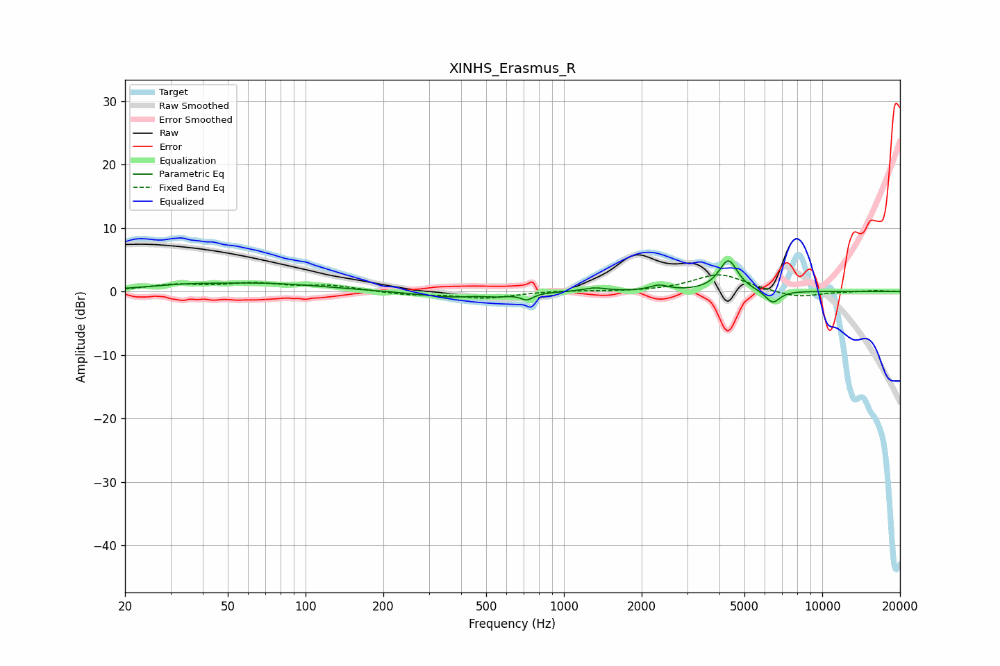

# XINHS_Erasmus_R
See [usage instructions](https://github.com/jaakkopasanen/AutoEq#usage) for more options and info.

### Parametric EQs
Apply preamp of -4.9 dB when using parametric equalizer.

|   # | Type    |   Fc (Hz) |    Q |   Gain (dB) |
|-----|---------|-----------|------|-------------|
|   1 | Peaking |        33 | 0.97 |         0.6 |
|   2 | Peaking |        71 | 0.61 |         1.2 |
|   3 | Peaking |       401 | 1.06 |        -1.5 |
|   4 | Peaking |       480 | 1.4  |         1.1 |
|   5 | Peaking |       537 | 2.12 |        -0.8 |
|   6 | Peaking |       720 | 6    |        -1   |
|   7 | Peaking |      1315 | 3.05 |         0.6 |
|   8 | Peaking |      2332 | 4.03 |         0.9 |
|   9 | Peaking |      4331 | 3.91 |         4.9 |
|  10 | Peaking |      6426 | 4.78 |        -2   |

### Fixed Band EQs
When using fixed band (also called graphic) equalizer, apply preamp of **-2.7 dB** (if available) and set gains manually with these parameters.

|   # | Type    |   Fc (Hz) |    Q |   Gain (dB) |
|-----|---------|-----------|------|-------------|
|   1 | Peaking |        31 | 1.41 |         1   |
|   2 | Peaking |        62 | 1.41 |         1.1 |
|   3 | Peaking |       125 | 1.41 |         0.9 |
|   4 | Peaking |       250 | 1.41 |        -0.5 |
|   5 | Peaking |       500 | 1.41 |        -1   |
|   6 | Peaking |      1000 | 1.41 |         0.2 |
|   7 | Peaking |      2000 | 1.41 |        -0.1 |
|   8 | Peaking |      4000 | 1.41 |         2.8 |
|   9 | Peaking |      8000 | 1.41 |        -1   |
|  10 | Peaking |     16000 | 1.41 |         0.2 |

### Graphs

