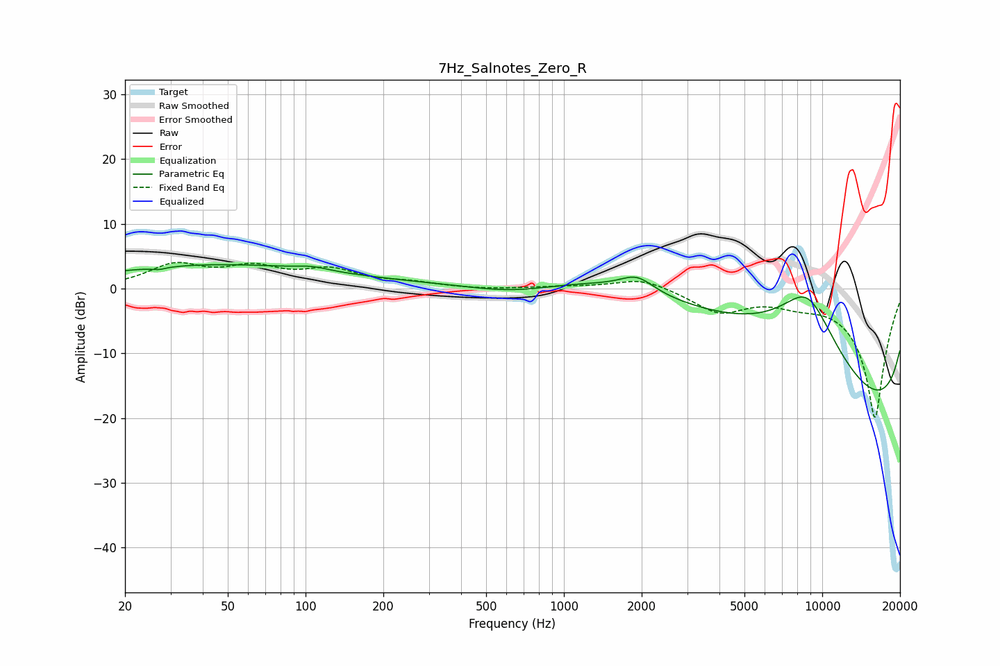

# 7Hz_Salnotes_Zero_R
See [usage instructions](https://github.com/jaakkopasanen/AutoEq#usage) for more options and info.

### Parametric EQs
Apply preamp of -3.8 dB when using parametric equalizer.

|   # | Type    |   Fc (Hz) |    Q |   Gain (dB) |
|-----|---------|-----------|------|-------------|
|   1 | Peaking |        27 | 5.33 |        -0.4 |
|   2 | Peaking |        31 | 0.38 |         2.7 |
|   3 | Peaking |        92 | 0.42 |         1.7 |
|   4 | Peaking |       106 | 2.32 |         0.6 |
|   5 | Peaking |       655 | 0.67 |        -3   |
|   6 | Peaking |      1918 | 2.21 |         2.4 |
|   7 | Peaking |      3113 | 0.22 |        11.2 |
|   8 | Peaking |      8767 | 0.64 |        19.5 |
|   9 | Peaking |     10000 | 0.18 |       -10.8 |
|  10 | Peaking |     10000 | 0.18 |       -18.2 |

### Fixed Band EQs
When using fixed band (also called graphic) equalizer, apply preamp of **-4.1 dB** (if available) and set gains manually with these parameters.

|   # | Type    |   Fc (Hz) |    Q |   Gain (dB) |
|-----|---------|-----------|------|-------------|
|   1 | Peaking |        31 | 1.41 |         3.4 |
|   2 | Peaking |        62 | 1.41 |         2.8 |
|   3 | Peaking |       125 | 1.41 |         2.5 |
|   4 | Peaking |       250 | 1.41 |         0.8 |
|   5 | Peaking |       500 | 1.41 |        -0.2 |
|   6 | Peaking |      1000 | 1.41 |         0.2 |
|   7 | Peaking |      2000 | 1.41 |         1.7 |
|   8 | Peaking |      4000 | 1.41 |        -3.5 |
|   9 | Peaking |      8000 | 1.41 |        -1.4 |
|  10 | Peaking |     16000 | 1.41 |       -20   |

### Graphs

