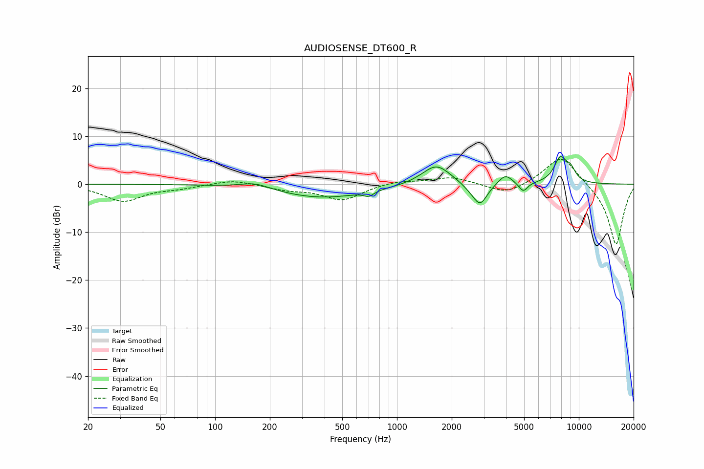

# AUDIOSENSE_DT600_R
See [usage instructions](https://github.com/jaakkopasanen/AutoEq#usage) for more options and info.

### Parametric EQs
Apply preamp of -5.9 dB when using parametric equalizer.

|   # | Type    |   Fc (Hz) |    Q |   Gain (dB) |
|-----|---------|-----------|------|-------------|
|   1 | Peaking |       166 | 1.72 |         1.3 |
|   2 | Peaking |       389 | 0.58 |        -2.8 |
|   3 | Peaking |       700 | 5.2  |        -1   |
|   4 | Peaking |      1645 | 1.79 |         4.3 |
|   5 | Peaking |      2514 | 2.93 |        -0.7 |
|   6 | Peaking |      2864 | 3.52 |        -4.4 |
|   7 | Peaking |      3939 | 3.66 |         2.2 |
|   8 | Peaking |      4946 | 5.74 |        -2   |
|   9 | Peaking |      7906 | 3.74 |         5.1 |
|  10 | Peaking |      9010 | 4.55 |         2.3 |

### Fixed Band EQs
When using fixed band (also called graphic) equalizer, apply preamp of **-5.3 dB** (if available) and set gains manually with these parameters.

|   # | Type    |   Fc (Hz) |    Q |   Gain (dB) |
|-----|---------|-----------|------|-------------|
|   1 | Peaking |        31 | 1.41 |        -3.5 |
|   2 | Peaking |        62 | 1.41 |        -0.7 |
|   3 | Peaking |       125 | 1.41 |         1   |
|   4 | Peaking |       250 | 1.41 |        -1   |
|   5 | Peaking |       500 | 1.41 |        -3.3 |
|   6 | Peaking |      1000 | 1.41 |         0.8 |
|   7 | Peaking |      2000 | 1.41 |         1.5 |
|   8 | Peaking |      4000 | 1.41 |        -2.2 |
|   9 | Peaking |      8000 | 1.41 |         6.3 |
|  10 | Peaking |     16000 | 1.41 |       -12.9 |

### Graphs

