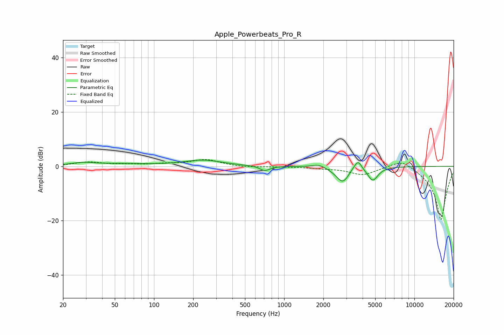

# Apple_Powerbeats_Pro_R
See [usage instructions](https://github.com/jaakkopasanen/AutoEq#usage) for more options and info.

### Parametric EQs
Apply preamp of -2.4 dB when using parametric equalizer.

|   # | Type    |   Fc (Hz) |    Q |   Gain (dB) |
|-----|---------|-----------|------|-------------|
|   1 | Peaking |        28 | 2.51 |        -0.5 |
|   2 | Peaking |        28 | 1.85 |         1.5 |
|   3 | Peaking |        56 | 0.68 |         0.8 |
|   4 | Peaking |       237 | 0.96 |         2.2 |
|   5 | Peaking |       710 | 3.74 |        -1.8 |
|   6 | Peaking |      1838 | 2.95 |         1.2 |
|   7 | Peaking |      2822 | 2.67 |        -6.2 |
|   8 | Peaking |      3520 | 2.96 |         2   |
|   9 | Peaking |      3706 | 5.97 |         2.4 |
|  10 | Peaking |      4790 | 3.55 |        -5.1 |

### Fixed Band EQs
When using fixed band (also called graphic) equalizer, apply preamp of **-2.6 dB** (if available) and set gains manually with these parameters.

|   # | Type    |   Fc (Hz) |    Q |   Gain (dB) |
|-----|---------|-----------|------|-------------|
|   1 | Peaking |        31 | 1.41 |         1.5 |
|   2 | Peaking |        62 | 1.41 |         0.5 |
|   3 | Peaking |       125 | 1.41 |         0.7 |
|   4 | Peaking |       250 | 1.41 |         2.4 |
|   5 | Peaking |       500 | 1.41 |        -0.4 |
|   6 | Peaking |      1000 | 1.41 |        -0.1 |
|   7 | Peaking |      2000 | 1.41 |        -0.5 |
|   8 | Peaking |      4000 | 1.41 |        -3   |
|   9 | Peaking |      8000 | 1.41 |         3.3 |
|  10 | Peaking |     16000 | 1.41 |       -20   |

### Graphs

