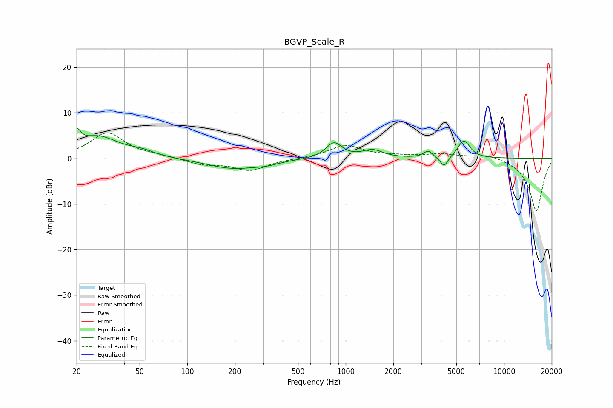

# BGVP_Scale_R
See [usage instructions](https://github.com/jaakkopasanen/AutoEq#usage) for more options and info.

### Parametric EQs
Apply preamp of -6.6 dB when using parametric equalizer.

|   # | Type    |   Fc (Hz) |    Q |   Gain (dB) |
|-----|---------|-----------|------|-------------|
|   1 | Peaking |        20 | 5.82 |         3.3 |
|   2 | Peaking |        27 | 1.07 |         4.7 |
|   3 | Peaking |        51 | 1.84 |         0.9 |
|   4 | Peaking |       194 | 0.85 |        -2.2 |
|   5 | Peaking |       317 | 1.84 |        -0.6 |
|   6 | Peaking |       843 | 2.85 |         3.4 |
|   7 | Peaking |      1480 | 2.25 |         1.7 |
|   8 | Peaking |      3317 | 5.04 |         1.5 |
|   9 | Peaking |      4186 | 5.66 |        -2.3 |
|  10 | Peaking |      5575 | 3.69 |         3.9 |

### Fixed Band EQs
When using fixed band (also called graphic) equalizer, apply preamp of **-5.7 dB** (if available) and set gains manually with these parameters.

|   # | Type    |   Fc (Hz) |    Q |   Gain (dB) |
|-----|---------|-----------|------|-------------|
|   1 | Peaking |        31 | 1.41 |         5.5 |
|   2 | Peaking |        62 | 1.41 |         0.5 |
|   3 | Peaking |       125 | 1.41 |        -1.3 |
|   4 | Peaking |       250 | 1.41 |        -2.6 |
|   5 | Peaking |       500 | 1.41 |        -0.1 |
|   6 | Peaking |      1000 | 1.41 |         2.8 |
|   7 | Peaking |      2000 | 1.41 |         0.4 |
|   8 | Peaking |      4000 | 1.41 |         0.9 |
|   9 | Peaking |      8000 | 1.41 |         1   |
|  10 | Peaking |     16000 | 1.41 |       -11.6 |

### Graphs

