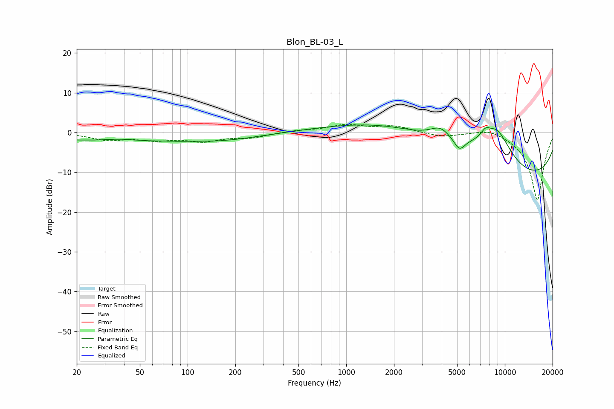

# Blon_BL-03_L
See [usage instructions](https://github.com/jaakkopasanen/AutoEq#usage) for more options and info.

### Parametric EQs
Apply preamp of -2.0 dB when using parametric equalizer.

|   # | Type    |   Fc (Hz) |    Q |   Gain (dB) |
|-----|---------|-----------|------|-------------|
|   1 | Peaking |        37 | 1.69 |         0.5 |
|   2 | Peaking |        42 | 0.18 |        -2.1 |
|   3 | Peaking |       177 | 0.7  |        -0.7 |
|   4 | Peaking |      2030 | 0.4  |         6.4 |
|   5 | Peaking |      3920 | 2.16 |         3   |
|   6 | Peaking |      5173 | 3.95 |        -3   |
|   7 | Peaking |      6541 | 0.49 |         5.3 |
|   8 | Peaking |      7530 | 4.79 |         1.7 |
|   9 | Peaking |      8879 | 1.39 |         8.2 |
|  10 | Peaking |      9521 | 0.18 |       -14   |

### Fixed Band EQs
When using fixed band (also called graphic) equalizer, apply preamp of **-2.1 dB** (if available) and set gains manually with these parameters.

|   # | Type    |   Fc (Hz) |    Q |   Gain (dB) |
|-----|---------|-----------|------|-------------|
|   1 | Peaking |        31 | 1.41 |        -1.7 |
|   2 | Peaking |        62 | 1.41 |        -1.6 |
|   3 | Peaking |       125 | 1.41 |        -2   |
|   4 | Peaking |       250 | 1.41 |        -1.2 |
|   5 | Peaking |       500 | 1.41 |         0.5 |
|   6 | Peaking |      1000 | 1.41 |         1.8 |
|   7 | Peaking |      2000 | 1.41 |         1.5 |
|   8 | Peaking |      4000 | 1.41 |        -1.1 |
|   9 | Peaking |      8000 | 1.41 |         1.4 |
|  10 | Peaking |     16000 | 1.41 |       -17.2 |

### Graphs

