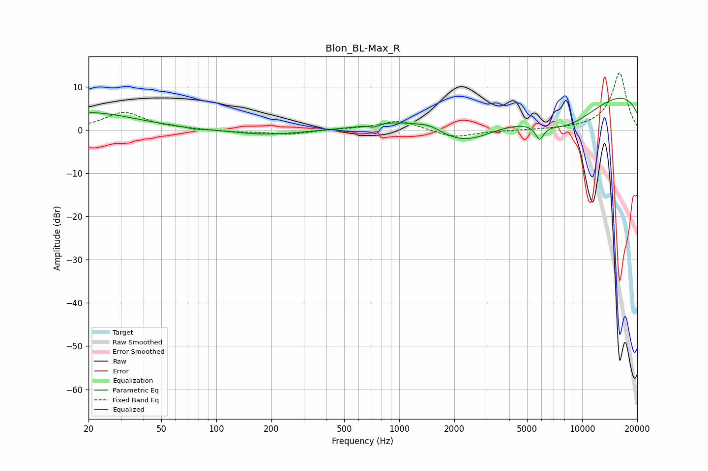

# Blon_BL-Max_R
See [usage instructions](https://github.com/jaakkopasanen/AutoEq#usage) for more options and info.

### Parametric EQs
Apply preamp of -7.4 dB when using parametric equalizer.

|   # | Type    |   Fc (Hz) |    Q |   Gain (dB) |
|-----|---------|-----------|------|-------------|
|   1 | Peaking |        20 | 0.56 |         4   |
|   2 | Peaking |        76 | 4.48 |        -0.3 |
|   3 | Peaking |       187 | 0.74 |        -1.2 |
|   4 | Peaking |       726 | 5.99 |        -0.6 |
|   5 | Peaking |      1003 | 0.83 |         2.3 |
|   6 | Peaking |      1477 | 1.98 |         1.5 |
|   7 | Peaking |      2273 | 0.69 |        -7.4 |
|   8 | Peaking |      5857 | 5.92 |        -3.4 |
|   9 | Peaking |      8114 | 0.59 |        -9.2 |
|  10 | Peaking |     10000 | 0.18 |        11.6 |

### Fixed Band EQs
When using fixed band (also called graphic) equalizer, apply preamp of **-13.3 dB** (if available) and set gains manually with these parameters.

|   # | Type    |   Fc (Hz) |    Q |   Gain (dB) |
|-----|---------|-----------|------|-------------|
|   1 | Peaking |        31 | 1.41 |         4   |
|   2 | Peaking |        62 | 1.41 |         0.2 |
|   3 | Peaking |       125 | 1.41 |        -0.4 |
|   4 | Peaking |       250 | 1.41 |        -1   |
|   5 | Peaking |       500 | 1.41 |         0.2 |
|   6 | Peaking |      1000 | 1.41 |         2.2 |
|   7 | Peaking |      2000 | 1.41 |        -1.8 |
|   8 | Peaking |      4000 | 1.41 |        -0.1 |
|   9 | Peaking |      8000 | 1.41 |         0   |
|  10 | Peaking |     16000 | 1.41 |        13.3 |

### Graphs

