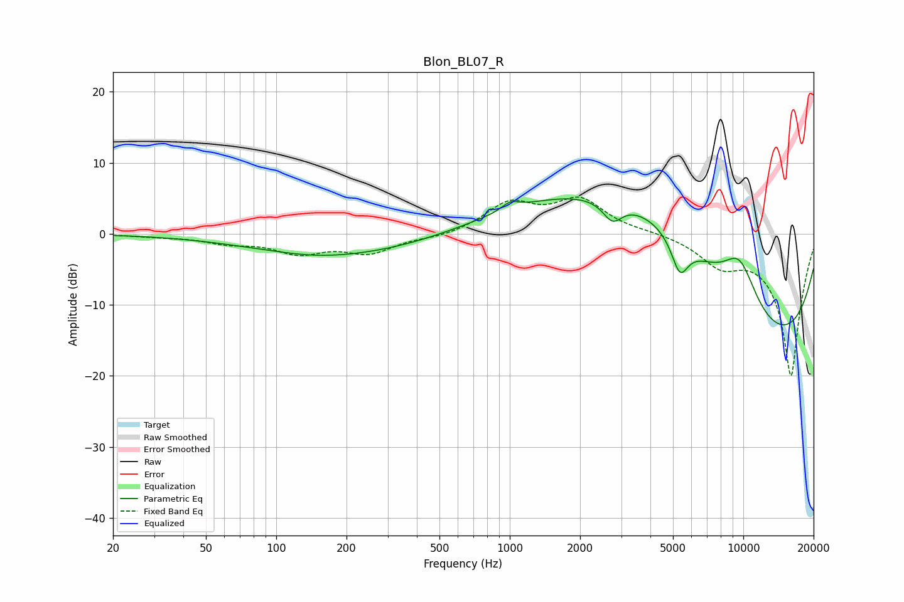

# Blon_BL07_R
See [usage instructions](https://github.com/jaakkopasanen/AutoEq#usage) for more options and info.

### Parametric EQs
Apply preamp of -5.0 dB when using parametric equalizer.

|   # | Type    |   Fc (Hz) |    Q |   Gain (dB) |
|-----|---------|-----------|------|-------------|
|   1 | Peaking |       148 | 0.98 |        -0.3 |
|   2 | Peaking |       313 | 0.25 |        -3.9 |
|   3 | Peaking |      1006 | 3.94 |         1.1 |
|   4 | Peaking |      2387 | 0.19 |         5.9 |
|   5 | Peaking |      2753 | 3.39 |        -2.9 |
|   6 | Peaking |      4228 | 0.37 |        11.3 |
|   7 | Peaking |      5350 | 3.82 |        -4.9 |
|   8 | Peaking |      9636 | 1.62 |         7   |
|   9 | Peaking |      9892 | 0.29 |        -8.5 |
|  10 | Peaking |      9977 | 0.2  |       -11.8 |

### Fixed Band EQs
When using fixed band (also called graphic) equalizer, apply preamp of **-5.3 dB** (if available) and set gains manually with these parameters.

|   # | Type    |   Fc (Hz) |    Q |   Gain (dB) |
|-----|---------|-----------|------|-------------|
|   1 | Peaking |        31 | 1.41 |        -0.3 |
|   2 | Peaking |        62 | 1.41 |        -1.1 |
|   3 | Peaking |       125 | 1.41 |        -2.4 |
|   4 | Peaking |       250 | 1.41 |        -2.5 |
|   5 | Peaking |       500 | 1.41 |        -0.5 |
|   6 | Peaking |      1000 | 1.41 |         4.1 |
|   7 | Peaking |      2000 | 1.41 |         4.6 |
|   8 | Peaking |      4000 | 1.41 |         0.3 |
|   9 | Peaking |      8000 | 1.41 |        -3.5 |
|  10 | Peaking |     16000 | 1.41 |       -20   |

### Graphs

