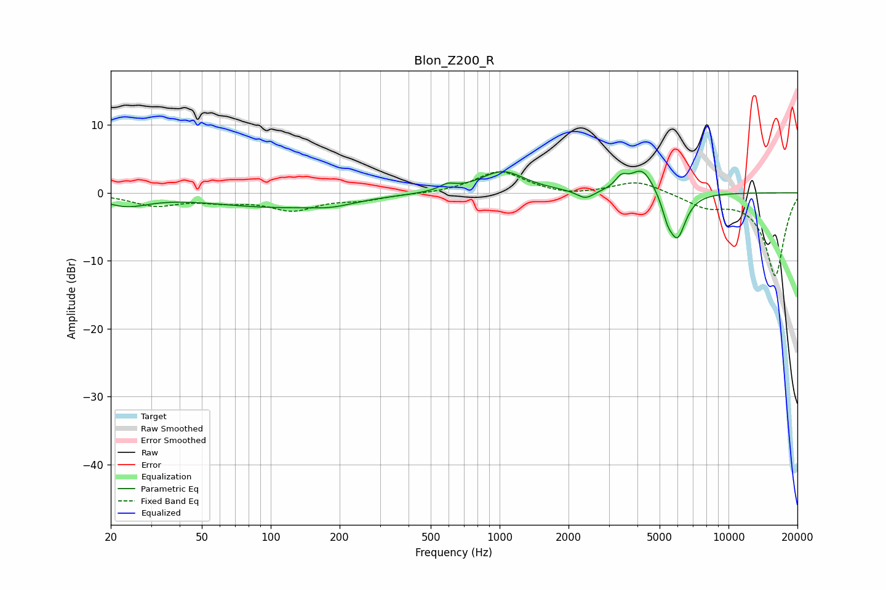

# Blon_Z200_R
See [usage instructions](https://github.com/jaakkopasanen/AutoEq#usage) for more options and info.

### Parametric EQs
Apply preamp of -3.3 dB when using parametric equalizer.

|   # | Type    |   Fc (Hz) |    Q |   Gain (dB) |
|-----|---------|-----------|------|-------------|
|   1 | Peaking |        23 | 1.44 |        -1.7 |
|   2 | Peaking |       103 | 0.49 |        -2   |
|   3 | Peaking |       185 | 1.49 |        -0.7 |
|   4 | Peaking |       591 | 4.12 |         0.9 |
|   5 | Peaking |      1031 | 1.47 |         3.2 |
|   6 | Peaking |      2373 | 3.63 |        -1.3 |
|   7 | Peaking |      3401 | 5.42 |         1.5 |
|   8 | Peaking |      4202 | 2.65 |         3.8 |
|   9 | Peaking |      5411 | 5.89 |        -2.2 |
|  10 | Peaking |      5983 | 3.63 |        -6.6 |

### Fixed Band EQs
When using fixed band (also called graphic) equalizer, apply preamp of **-3.2 dB** (if available) and set gains manually with these parameters.

|   # | Type    |   Fc (Hz) |    Q |   Gain (dB) |
|-----|---------|-----------|------|-------------|
|   1 | Peaking |        31 | 1.41 |        -1.7 |
|   2 | Peaking |        62 | 1.41 |        -1   |
|   3 | Peaking |       125 | 1.41 |        -2.3 |
|   4 | Peaking |       250 | 1.41 |        -0.9 |
|   5 | Peaking |       500 | 1.41 |        -0.1 |
|   6 | Peaking |      1000 | 1.41 |         3.2 |
|   7 | Peaking |      2000 | 1.41 |        -0.5 |
|   8 | Peaking |      4000 | 1.41 |         1.8 |
|   9 | Peaking |      8000 | 1.41 |        -1.8 |
|  10 | Peaking |     16000 | 1.41 |       -12.2 |

### Graphs

