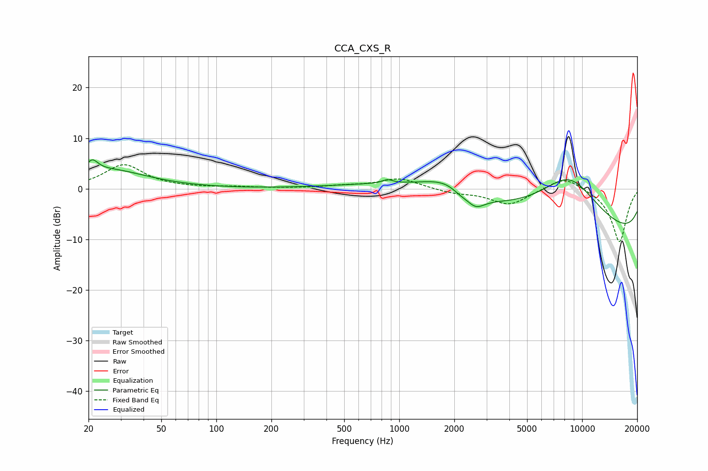

# CCA_CXS_R
See [usage instructions](https://github.com/jaakkopasanen/AutoEq#usage) for more options and info.

### Parametric EQs
Apply preamp of -5.8 dB when using parametric equalizer.

|   # | Type    |   Fc (Hz) |    Q |   Gain (dB) |
|-----|---------|-----------|------|-------------|
|   1 | Peaking |        21 | 4.58 |         2.3 |
|   2 | Peaking |        26 | 0.67 |         3.6 |
|   3 | Peaking |       862 | 5.28 |         0.7 |
|   4 | Peaking |      1111 | 0.46 |         2   |
|   5 | Peaking |      1868 | 0.96 |         3.7 |
|   6 | Peaking |      2142 | 3.17 |        -0.9 |
|   7 | Peaking |      2580 | 2.17 |        -1.2 |
|   8 | Peaking |      2618 | 3.06 |        -1.5 |
|   9 | Peaking |      8461 | 0.52 |        16   |
|  10 | Peaking |     10000 | 0.18 |       -14.6 |

### Fixed Band EQs
When using fixed band (also called graphic) equalizer, apply preamp of **-4.8 dB** (if available) and set gains manually with these parameters.

|   # | Type    |   Fc (Hz) |    Q |   Gain (dB) |
|-----|---------|-----------|------|-------------|
|   1 | Peaking |        31 | 1.41 |         4.7 |
|   2 | Peaking |        62 | 1.41 |         0.1 |
|   3 | Peaking |       125 | 1.41 |         0.3 |
|   4 | Peaking |       250 | 1.41 |         0   |
|   5 | Peaking |       500 | 1.41 |         0.5 |
|   6 | Peaking |      1000 | 1.41 |         2.1 |
|   7 | Peaking |      2000 | 1.41 |        -0.8 |
|   8 | Peaking |      4000 | 1.41 |        -3.2 |
|   9 | Peaking |      8000 | 1.41 |         2.7 |
|  10 | Peaking |     16000 | 1.41 |       -10.6 |

### Graphs

