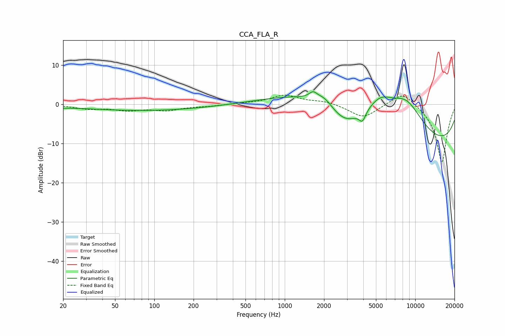

# CCA_FLA_R
See [usage instructions](https://github.com/jaakkopasanen/AutoEq#usage) for more options and info.

### Parametric EQs
Apply preamp of -3.3 dB when using parametric equalizer.

|   # | Type    |   Fc (Hz) |    Q |   Gain (dB) |
|-----|---------|-----------|------|-------------|
|   1 | Peaking |        20 | 2.49 |        -0.3 |
|   2 | Peaking |        84 | 0.29 |        -1.6 |
|   3 | Peaking |      1649 | 4.68 |         1.6 |
|   4 | Peaking |      1868 | 0.42 |         5.7 |
|   5 | Peaking |      2004 | 2.43 |         2   |
|   6 | Peaking |      2880 | 1.34 |        -3.6 |
|   7 | Peaking |      3938 | 5.88 |        -2.5 |
|   8 | Peaking |      5403 | 1.34 |         5.4 |
|   9 | Peaking |      8517 | 0.83 |        10.5 |
|  10 | Peaking |      9775 | 0.18 |       -12.1 |

### Fixed Band EQs
When using fixed band (also called graphic) equalizer, apply preamp of **-2.5 dB** (if available) and set gains manually with these parameters.

|   # | Type    |   Fc (Hz) |    Q |   Gain (dB) |
|-----|---------|-----------|------|-------------|
|   1 | Peaking |        31 | 1.41 |        -1   |
|   2 | Peaking |        62 | 1.41 |        -1.3 |
|   3 | Peaking |       125 | 1.41 |        -1.3 |
|   4 | Peaking |       250 | 1.41 |        -0.4 |
|   5 | Peaking |       500 | 1.41 |         0.2 |
|   6 | Peaking |      1000 | 1.41 |         2.3 |
|   7 | Peaking |      2000 | 1.41 |         0.8 |
|   8 | Peaking |      4000 | 1.41 |        -3.5 |
|   9 | Peaking |      8000 | 1.41 |         3.6 |
|  10 | Peaking |     16000 | 1.41 |       -15   |

### Graphs

