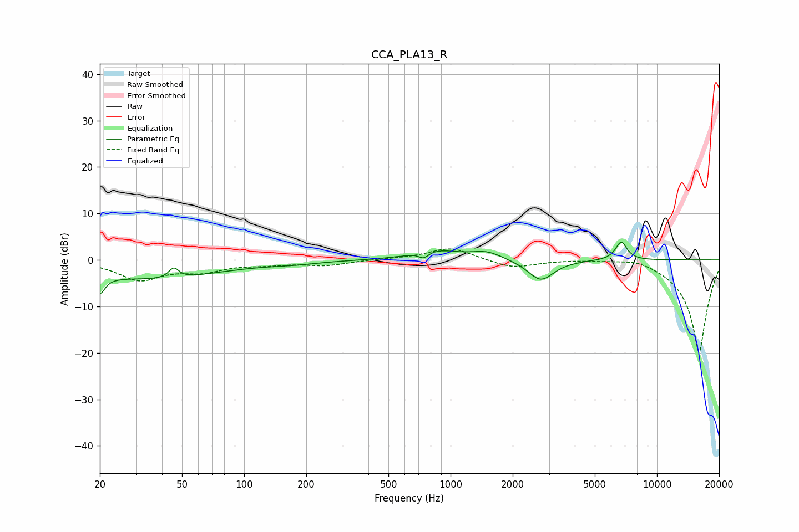

# CCA_PLA13_R
See [usage instructions](https://github.com/jaakkopasanen/AutoEq#usage) for more options and info.

### Parametric EQs
Apply preamp of -3.9 dB when using parametric equalizer.

|   # | Type    |   Fc (Hz) |    Q |   Gain (dB) |
|-----|---------|-----------|------|-------------|
|   1 | Peaking |        20 | 5.96 |        -3.5 |
|   2 | Peaking |        20 | 0.23 |        -3.3 |
|   3 | Peaking |        43 | 0.78 |        -1.1 |
|   4 | Peaking |        46 | 6    |         2.2 |
|   5 | Peaking |       175 | 1.24 |        -0.4 |
|   6 | Peaking |       741 | 6    |        -1.4 |
|   7 | Peaking |       850 | 1.25 |         2   |
|   8 | Peaking |      1502 | 1.92 |         1.6 |
|   9 | Peaking |      2736 | 2.25 |        -4.5 |
|  10 | Peaking |      6714 | 4.92 |         4   |

### Fixed Band EQs
When using fixed band (also called graphic) equalizer, apply preamp of **-2.4 dB** (if available) and set gains manually with these parameters.

|   # | Type    |   Fc (Hz) |    Q |   Gain (dB) |
|-----|---------|-----------|------|-------------|
|   1 | Peaking |        31 | 1.41 |        -4.1 |
|   2 | Peaking |        62 | 1.41 |        -2.1 |
|   3 | Peaking |       125 | 1.41 |        -0.7 |
|   4 | Peaking |       250 | 1.41 |        -1.1 |
|   5 | Peaking |       500 | 1.41 |         0.2 |
|   6 | Peaking |      1000 | 1.41 |         2.7 |
|   7 | Peaking |      2000 | 1.41 |        -1.8 |
|   8 | Peaking |      4000 | 1.41 |         0.2 |
|   9 | Peaking |      8000 | 1.41 |         1.1 |
|  10 | Peaking |     16000 | 1.41 |       -20   |

### Graphs

