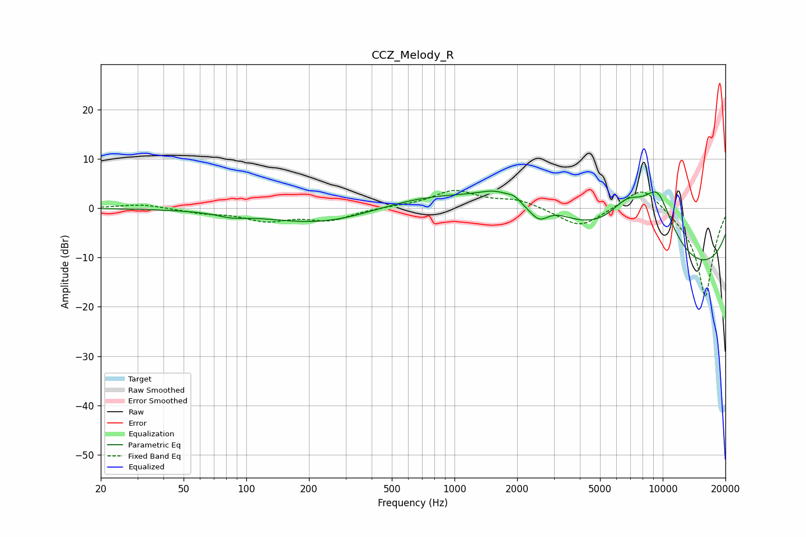

# CCZ_Melody_R
See [usage instructions](https://github.com/jaakkopasanen/AutoEq#usage) for more options and info.

### Parametric EQs
Apply preamp of -3.6 dB when using parametric equalizer.

|   # | Type    |   Fc (Hz) |    Q |   Gain (dB) |
|-----|---------|-----------|------|-------------|
|   1 | Peaking |        85 | 2.1  |        -0.8 |
|   2 | Peaking |       247 | 0.51 |        -3.8 |
|   3 | Peaking |      1582 | 1.76 |         2.2 |
|   4 | Peaking |      1936 | 4.56 |         1.1 |
|   5 | Peaking |      2134 | 0.23 |         8.6 |
|   6 | Peaking |      2554 | 3.15 |        -2.9 |
|   7 | Peaking |      2920 | 1.67 |         1.7 |
|   8 | Peaking |      6750 | 1.43 |         6.8 |
|   9 | Peaking |      9061 | 0.19 |       -18.3 |
|  10 | Peaking |      9466 | 1.22 |        14.9 |

### Fixed Band EQs
When using fixed band (also called graphic) equalizer, apply preamp of **-3.7 dB** (if available) and set gains manually with these parameters.

|   # | Type    |   Fc (Hz) |    Q |   Gain (dB) |
|-----|---------|-----------|------|-------------|
|   1 | Peaking |        31 | 1.41 |         0.9 |
|   2 | Peaking |        62 | 1.41 |        -0.8 |
|   3 | Peaking |       125 | 1.41 |        -2.3 |
|   4 | Peaking |       250 | 1.41 |        -2.3 |
|   5 | Peaking |       500 | 1.41 |         0.3 |
|   6 | Peaking |      1000 | 1.41 |         3.5 |
|   7 | Peaking |      2000 | 1.41 |         1.7 |
|   8 | Peaking |      4000 | 1.41 |        -4   |
|   9 | Peaking |      8000 | 1.41 |         5.3 |
|  10 | Peaking |     16000 | 1.41 |       -18.2 |

### Graphs

