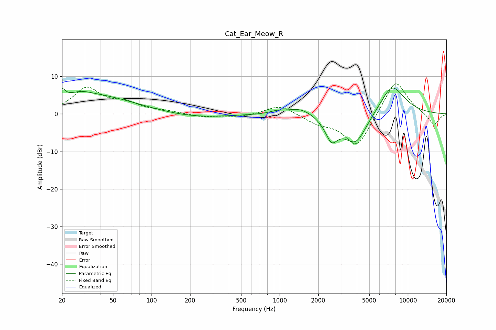

# Cat_Ear_Meow_R
See [usage instructions](https://github.com/jaakkopasanen/AutoEq#usage) for more options and info.

### Parametric EQs
Apply preamp of -7.0 dB when using parametric equalizer.

|   # | Type    |   Fc (Hz) |    Q |   Gain (dB) |
|-----|---------|-----------|------|-------------|
|   1 | Peaking |        20 | 5.73 |         2.5 |
|   2 | Peaking |        28 | 1.7  |         1.3 |
|   3 | Peaking |        35 | 0.44 |         4.8 |
|   4 | Peaking |       220 | 0.56 |        -1.1 |
|   5 | Peaking |       954 | 2.67 |         0.6 |
|   6 | Peaking |      1448 | 1.43 |         2   |
|   7 | Peaking |      2537 | 2.84 |        -5.6 |
|   8 | Peaking |      3859 | 1.35 |        -6.9 |
|   9 | Peaking |      4017 | 2.34 |        -1.4 |
|  10 | Peaking |      7515 | 1.33 |         8.2 |

### Fixed Band EQs
When using fixed band (also called graphic) equalizer, apply preamp of **-8.1 dB** (if available) and set gains manually with these parameters.

|   # | Type    |   Fc (Hz) |    Q |   Gain (dB) |
|-----|---------|-----------|------|-------------|
|   1 | Peaking |        31 | 1.41 |         6.7 |
|   2 | Peaking |        62 | 1.41 |         2.5 |
|   3 | Peaking |       125 | 1.41 |         0.6 |
|   4 | Peaking |       250 | 1.41 |        -0.8 |
|   5 | Peaking |       500 | 1.41 |        -0.8 |
|   6 | Peaking |      1000 | 1.41 |         2.5 |
|   7 | Peaking |      2000 | 1.41 |        -2   |
|   8 | Peaking |      4000 | 1.41 |        -9.2 |
|   9 | Peaking |      8000 | 1.41 |         9.7 |
|  10 | Peaking |     16000 | 1.41 |        -3.2 |

### Graphs

