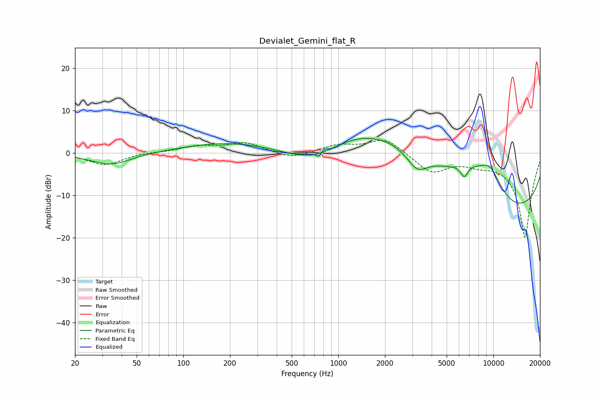

# Devialet_Gemini_flat_R
See [usage instructions](https://github.com/jaakkopasanen/AutoEq#usage) for more options and info.

### Parametric EQs
Apply preamp of -3.5 dB when using parametric equalizer.

|   # | Type    |   Fc (Hz) |    Q |   Gain (dB) |
|-----|---------|-----------|------|-------------|
|   1 | Peaking |        34 | 1.05 |        -2.9 |
|   2 | Peaking |       529 | 0.57 |        -4.2 |
|   3 | Peaking |       663 | 0.18 |         4.8 |
|   4 | Peaking |       740 | 0.84 |        -4.1 |
|   5 | Peaking |      2394 | 0.28 |         8.3 |
|   6 | Peaking |      3226 | 2.09 |        -4.3 |
|   7 | Peaking |      6502 | 5.86 |        -2.9 |
|   8 | Peaking |      7082 | 1.06 |         4.5 |
|   9 | Peaking |      9544 | 1.6  |         6.3 |
|  10 | Peaking |     10000 | 0.19 |       -16   |

### Fixed Band EQs
When using fixed band (also called graphic) equalizer, apply preamp of **-3.0 dB** (if available) and set gains manually with these parameters.

|   # | Type    |   Fc (Hz) |    Q |   Gain (dB) |
|-----|---------|-----------|------|-------------|
|   1 | Peaking |        31 | 1.41 |        -2.9 |
|   2 | Peaking |        62 | 1.41 |         0.2 |
|   3 | Peaking |       125 | 1.41 |         1.5 |
|   4 | Peaking |       250 | 1.41 |         2.3 |
|   5 | Peaking |       500 | 1.41 |        -1.5 |
|   6 | Peaking |      1000 | 1.41 |         1.7 |
|   7 | Peaking |      2000 | 1.41 |         3.5 |
|   8 | Peaking |      4000 | 1.41 |        -4.5 |
|   9 | Peaking |      8000 | 1.41 |        -1.6 |
|  10 | Peaking |     16000 | 1.41 |       -20   |

### Graphs

