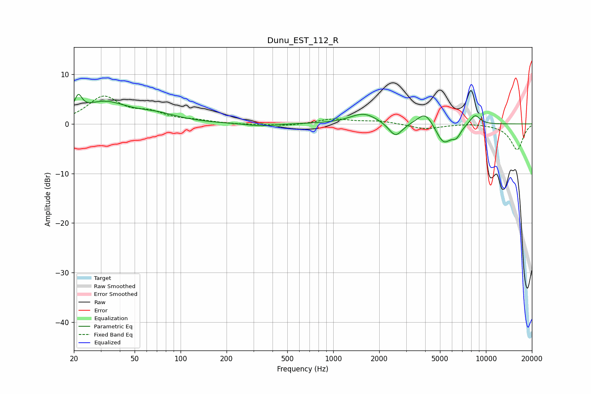

# Dunu_EST_112_R
See [usage instructions](https://github.com/jaakkopasanen/AutoEq#usage) for more options and info.

### Parametric EQs
Apply preamp of -6.0 dB when using parametric equalizer.

|   # | Type    |   Fc (Hz) |    Q |   Gain (dB) |
|-----|---------|-----------|------|-------------|
|   1 | Peaking |        21 | 5.98 |         3.2 |
|   2 | Peaking |        32 | 0.93 |         4.1 |
|   3 | Peaking |        70 | 1.01 |         1.4 |
|   4 | Peaking |       339 | 1.53 |        -0.5 |
|   5 | Peaking |      1586 | 1.58 |         2.2 |
|   6 | Peaking |      2556 | 3.19 |        -2.9 |
|   7 | Peaking |      4006 | 2.69 |         2.8 |
|   8 | Peaking |      5276 | 2.7  |        -4.1 |
|   9 | Peaking |      6406 | 4.61 |        -1.8 |
|  10 | Peaking |      8480 | 3.8  |         2.1 |

### Fixed Band EQs
When using fixed band (also called graphic) equalizer, apply preamp of **-5.7 dB** (if available) and set gains manually with these parameters.

|   # | Type    |   Fc (Hz) |    Q |   Gain (dB) |
|-----|---------|-----------|------|-------------|
|   1 | Peaking |        31 | 1.41 |         5.2 |
|   2 | Peaking |        62 | 1.41 |         1.8 |
|   3 | Peaking |       125 | 1.41 |         0.5 |
|   4 | Peaking |       250 | 1.41 |        -0.2 |
|   5 | Peaking |       500 | 1.41 |        -0.4 |
|   6 | Peaking |      1000 | 1.41 |         1   |
|   7 | Peaking |      2000 | 1.41 |         0.6 |
|   8 | Peaking |      4000 | 1.41 |        -1   |
|   9 | Peaking |      8000 | 1.41 |         0.2 |
|  10 | Peaking |     16000 | 1.41 |        -5.2 |

### Graphs

