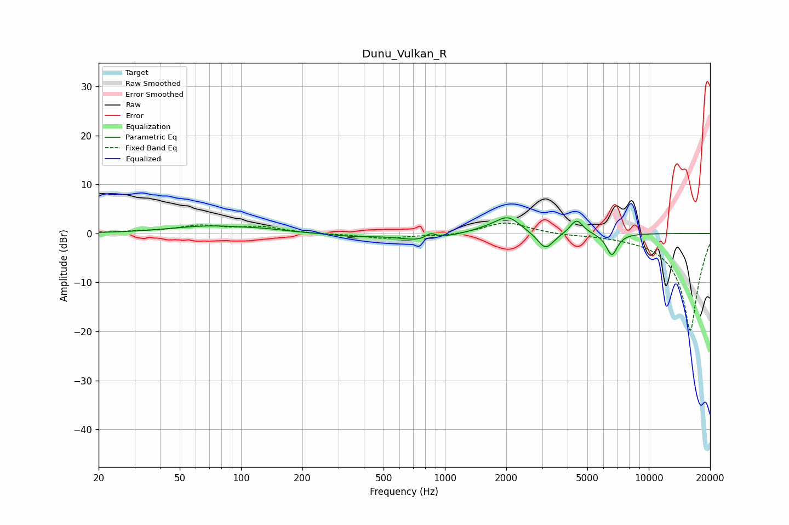

# Dunu_Vulkan_R
See [usage instructions](https://github.com/jaakkopasanen/AutoEq#usage) for more options and info.

### Parametric EQs
Apply preamp of -3.3 dB when using parametric equalizer.

|   # | Type    |   Fc (Hz) |    Q |   Gain (dB) |
|-----|---------|-----------|------|-------------|
|   1 | Peaking |        70 | 0.74 |         1.5 |
|   2 | Peaking |       129 | 1.4  |         0.4 |
|   3 | Peaking |       350 | 1.3  |        -0.5 |
|   4 | Peaking |       782 | 1.33 |        -1.6 |
|   5 | Peaking |       852 | 5.55 |         1.2 |
|   6 | Peaking |      1621 | 1.72 |         0.7 |
|   7 | Peaking |      2042 | 2.37 |         3.2 |
|   8 | Peaking |      3119 | 3.52 |        -3.5 |
|   9 | Peaking |      4426 | 4.41 |         3   |
|  10 | Peaking |      6591 | 4.94 |        -4.5 |

### Fixed Band EQs
When using fixed band (also called graphic) equalizer, apply preamp of **-2.2 dB** (if available) and set gains manually with these parameters.

|   # | Type    |   Fc (Hz) |    Q |   Gain (dB) |
|-----|---------|-----------|------|-------------|
|   1 | Peaking |        31 | 1.41 |         0.3 |
|   2 | Peaking |        62 | 1.41 |         1.5 |
|   3 | Peaking |       125 | 1.41 |         1.2 |
|   4 | Peaking |       250 | 1.41 |        -0.1 |
|   5 | Peaking |       500 | 1.41 |        -1   |
|   6 | Peaking |      1000 | 1.41 |        -0.5 |
|   7 | Peaking |      2000 | 1.41 |         2.4 |
|   8 | Peaking |      4000 | 1.41 |        -0.2 |
|   9 | Peaking |      8000 | 1.41 |        -0.2 |
|  10 | Peaking |     16000 | 1.41 |       -20   |

### Graphs

