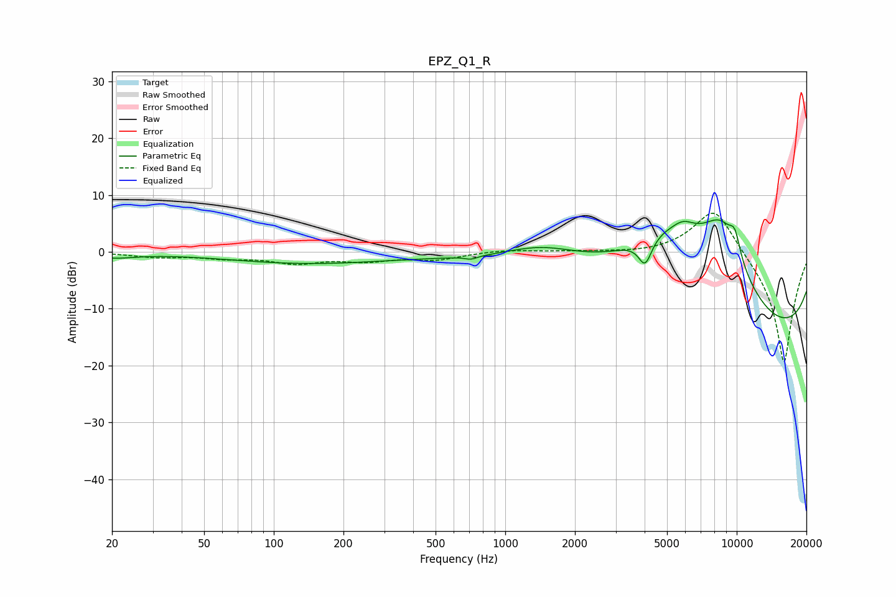

# EPZ_Q1_R
See [usage instructions](https://github.com/jaakkopasanen/AutoEq#usage) for more options and info.

### Parametric EQs
Apply preamp of -5.7 dB when using parametric equalizer.

|   # | Type    |   Fc (Hz) |    Q |   Gain (dB) |
|-----|---------|-----------|------|-------------|
|   1 | Peaking |        20 | 1.46 |        -0.9 |
|   2 | Peaking |       140 | 0.41 |        -2   |
|   3 | Peaking |       713 | 5.27 |        -0.6 |
|   4 | Peaking |      1440 | 0.79 |         3.8 |
|   5 | Peaking |      4021 | 4.83 |        -4.6 |
|   6 | Peaking |      4991 | 0.53 |        14.4 |
|   7 | Peaking |      5886 | 2.92 |         1.7 |
|   8 | Peaking |      8571 | 1    |        15.1 |
|   9 | Peaking |      9713 | 0.18 |       -20   |
|  10 | Peaking |      9820 | 5.08 |         3.8 |

### Fixed Band EQs
When using fixed band (also called graphic) equalizer, apply preamp of **-6.9 dB** (if available) and set gains manually with these parameters.

|   # | Type    |   Fc (Hz) |    Q |   Gain (dB) |
|-----|---------|-----------|------|-------------|
|   1 | Peaking |        31 | 1.41 |        -0.8 |
|   2 | Peaking |        62 | 1.41 |        -0.9 |
|   3 | Peaking |       125 | 1.41 |        -1.8 |
|   4 | Peaking |       250 | 1.41 |        -1.3 |
|   5 | Peaking |       500 | 1.41 |        -1.3 |
|   6 | Peaking |      1000 | 1.41 |         0.4 |
|   7 | Peaking |      2000 | 1.41 |         0.1 |
|   8 | Peaking |      4000 | 1.41 |        -0.3 |
|   9 | Peaking |      8000 | 1.41 |         8.6 |
|  10 | Peaking |     16000 | 1.41 |       -20   |

### Graphs

