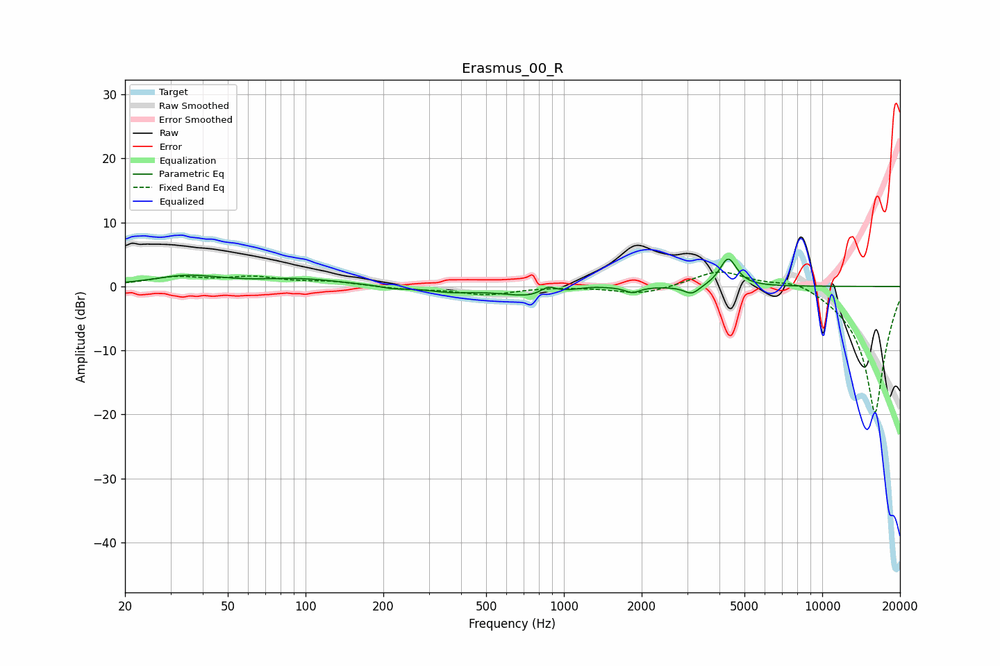

# Erasmus_00_R
See [usage instructions](https://github.com/jaakkopasanen/AutoEq#usage) for more options and info.

### Parametric EQs
Apply preamp of -4.3 dB when using parametric equalizer.

|   # | Type    |   Fc (Hz) |    Q |   Gain (dB) |
|-----|---------|-----------|------|-------------|
|   1 | Peaking |        35 | 1.09 |         1.6 |
|   2 | Peaking |        96 | 0.88 |         1.1 |
|   3 | Peaking |       218 | 3.06 |        -0.4 |
|   4 | Peaking |       362 | 1.5  |        -0.7 |
|   5 | Peaking |       775 | 1.22 |        -1.7 |
|   6 | Peaking |       870 | 4.45 |         1.3 |
|   7 | Peaking |      1264 | 2.02 |         0.4 |
|   8 | Peaking |      1842 | 5.2  |        -0.9 |
|   9 | Peaking |      3129 | 4.51 |        -1.4 |
|  10 | Peaking |      4324 | 4.33 |         4.4 |

### Fixed Band EQs
When using fixed band (also called graphic) equalizer, apply preamp of **-2.3 dB** (if available) and set gains manually with these parameters.

|   # | Type    |   Fc (Hz) |    Q |   Gain (dB) |
|-----|---------|-----------|------|-------------|
|   1 | Peaking |        31 | 1.41 |         1.3 |
|   2 | Peaking |        62 | 1.41 |         1.3 |
|   3 | Peaking |       125 | 1.41 |         0.7 |
|   4 | Peaking |       250 | 1.41 |        -0.4 |
|   5 | Peaking |       500 | 1.41 |        -1.2 |
|   6 | Peaking |      1000 | 1.41 |         0.1 |
|   7 | Peaking |      2000 | 1.41 |        -1.3 |
|   8 | Peaking |      4000 | 1.41 |         2.6 |
|   9 | Peaking |      8000 | 1.41 |         1.6 |
|  10 | Peaking |     16000 | 1.41 |       -20   |

### Graphs

