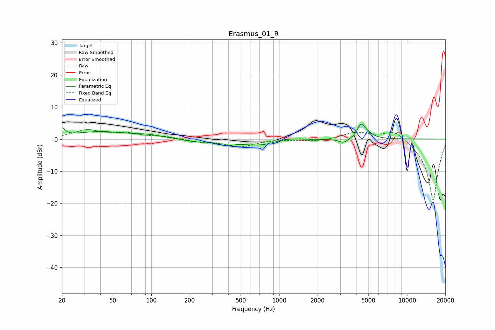

# Erasmus_01_R
See [usage instructions](https://github.com/jaakkopasanen/AutoEq#usage) for more options and info.

### Parametric EQs
Apply preamp of -4.8 dB when using parametric equalizer.

|   # | Type    |   Fc (Hz) |    Q |   Gain (dB) |
|-----|---------|-----------|------|-------------|
|   1 | Peaking |        20 | 5.98 |         2.4 |
|   2 | Peaking |        40 | 0.67 |         2.2 |
|   3 | Peaking |        95 | 1.35 |         0.8 |
|   4 | Peaking |       222 | 1.69 |        -0.7 |
|   5 | Peaking |       382 | 2.72 |        -1.2 |
|   6 | Peaking |       739 | 0.87 |        -2.3 |
|   7 | Peaking |      1107 | 1.28 |         1.3 |
|   8 | Peaking |      3185 | 3.91 |        -1.4 |
|   9 | Peaking |      4359 | 5.25 |         3.7 |
|  10 | Peaking |      4828 | 3.07 |         1.7 |

### Fixed Band EQs
When using fixed band (also called graphic) equalizer, apply preamp of **-3.1 dB** (if available) and set gains manually with these parameters.

|   # | Type    |   Fc (Hz) |    Q |   Gain (dB) |
|-----|---------|-----------|------|-------------|
|   1 | Peaking |        31 | 1.41 |         2.6 |
|   2 | Peaking |        62 | 1.41 |         1.6 |
|   3 | Peaking |       125 | 1.41 |         0.7 |
|   4 | Peaking |       250 | 1.41 |        -0.9 |
|   5 | Peaking |       500 | 1.41 |        -2.3 |
|   6 | Peaking |      1000 | 1.41 |        -0   |
|   7 | Peaking |      2000 | 1.41 |        -0.7 |
|   8 | Peaking |      4000 | 1.41 |         2.1 |
|   9 | Peaking |      8000 | 1.41 |         3.3 |
|  10 | Peaking |     16000 | 1.41 |       -19.3 |

### Graphs

